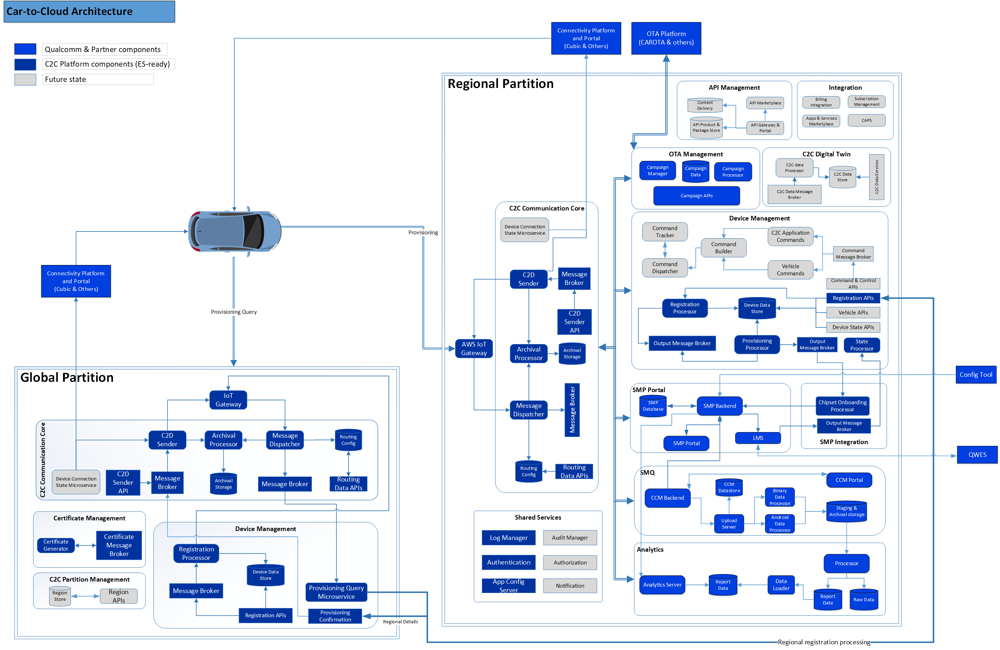
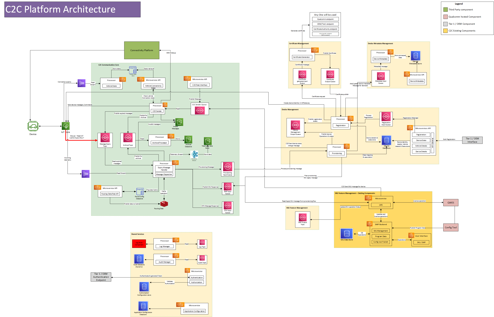
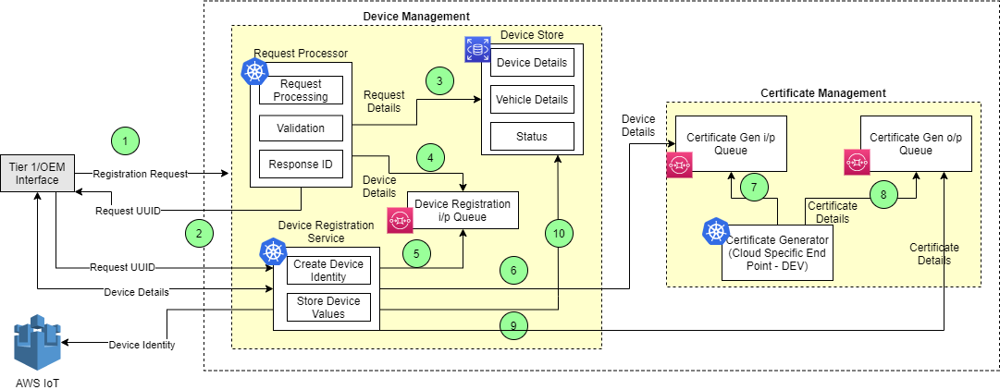
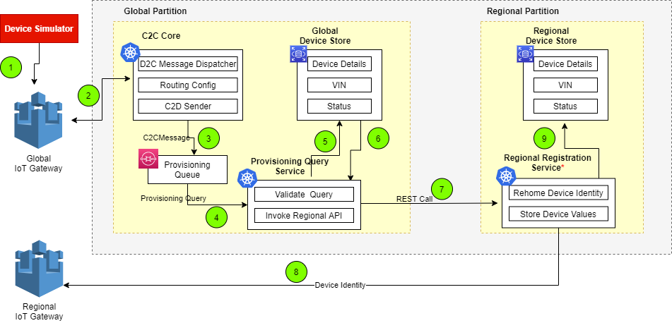
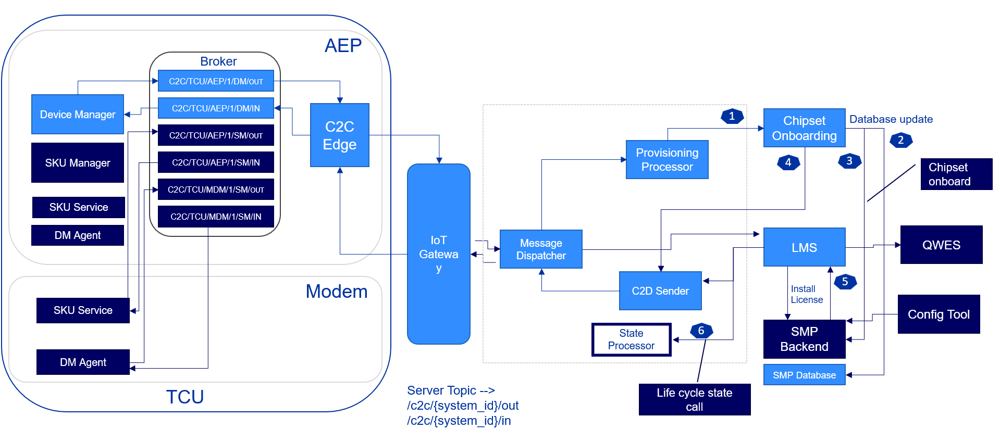

##  Logical Architecture
{ target:"_blank"}

C2C Platform Solution consists of two major components : 

* **Global Partition** 
* **Regional Partition** 

The reason behind the two components is to have fault tolerant system where one of the region down shall not impact the other region. 

### Global Partition
Global Partition perform registration of all the in-scope devices thus serving as a central repository of device’s as manufactured metadata. 
Serve as the global server responsible for provisioning the primary ECUs and rehoming the same to appropriate C2C partition in the target region.

Global Partition is divided into following functional groups : 

* **Communication Core** - Communication Core helps to create a communication channel through which services can establish communication with the vehicle/device
	+ IoT Gateway - It is the entry point for the communication between device and cloud It will support communication from and to the device It is leveraged for Device registry, Device Authentication, Device to Cloud Messaging & Cloud to Device Messaging.
	+ Message Dispatcher - This component will route messages coming from device to applications based on routing configurations
	+ Routing Config - Message dispatcher will fetch the routing details from this routing data base and dispatch the message to target route
	+ Routing Data APIs - These are REST APIs that perform CRUD operations on routing configurations 
	+ Archival Processor & Database - This component is responsible for achival of messages in the database which can be later used for analytics
	+ Message Broker -  It allows for messaging between device to cloud and cloud to device. 
	+ C2D Sender - This processor component is responsible to read the cloud to device topic and do augmentation similar to dispatcher for the message those are intended for Device. This component handover the message to IoT Gateway 
	+ C2D Sender API -  To perform message flow from Cloud to Device this api can be used to initiate any communication. Majorly it place the messages with required c2c message structure at c2d topic. 
* **Device Management** - It will perform the global registration of devices and rehoming to regional partition
	+ Registartion API - Registration API will be invoked by OEM/Tier 1 to perform the Device Registration process. 
	+ Message Broker - This component helps to transmit the registration request message to target location 
	+ Registration Processor - This processor initiate the registration process and store the device details in data store
	+ Provisioning Query Microservice - This processor listen to the messages received for provisioning and identify the regional instance.Using that regional details regional registration will be invoked.
	+ Provisioning Confirmation - Once regional registration completed , this confirmation API will be invoked and which inturn communicate back to device with regional details
* **Certificate Management** - This functional group will help in the generation of certificate during the device registration 
	+ Certifcate Message Broker - The registration request details whch does not contain the certificate will be placed on this certificate message broker
	+ Certificate generator - This component creates the certificates either using AWS or Certificate Authority or Qualcomm End point/Tier1 End point.
* **Region Management** 
	+ Region APIs - 
	+ Region Database - 
### Regional Partition

Once the vehicle is registered in regional instance, all the communication here after will be done through the regional partition. 
Regional Partition is divided into following functional groups: 

* **Communication Core** 
	+ IoT Gateway - It is the entry point for the communication between device and cloud It will support communication from and to the device It is leveraged for Device registry, Device Authentication, Device to Cloud Messaging & Cloud to Device Messaging. 
	+ Message Dispatcher - This component will route messages coming from device to applications based on routing configurations 
	+ Routing Config - Message dispatcher will fetch the routing details from this routing data base and dispatch the message to target route 
	+ Routing Data APIs - These are REST APIs that perform CRUD operations on routing configurations  
	+ Archival Processor & Database - This component is responsible for achival of messages in the database which can be later used for analytics 
	+ Message Broker - It allows for messaging between device to cloud and cloud to device.  
	+ C2D Sender - This processor component is responsible to read the cloud to device topic and do augmentation similar to dispatcher for the message those are intended for Device. This component handover the message to IoT Gateway  
	+ C2D Sender API - To perform message flow from Cloud to Device this API can be used to initiate any communication. Majorly it place the messages with required c2c message structure at c2d topic.  
	
* **Device Management** 
	+ Registartion API - Registration API will be invoked by Global Partition to perform the regional device registration process.  
	+ Registration Processor - This processor initiate the registration process and store the device details in regional data store 
	+ Output Message Broker - This component helps to transmit the registration response message to target location  
	
* **SMP Portal**  

* **SMP Integration points** 

* **OTA Management** 

* **Device Metadata** 

* **Shared Services** 
	+ Authentication - An external application /  user interface will validate user credentials against a authentication provider and as a result will receive a authentication token. Same token will be used by the external application / user interface to invoke a functionality of C2C platform APIs.

## AWS Architecture

### Device Registration 
{: .zoom}

Device Registration is an offline process where OEM/Tier1 will invoke the registration API of C2C platform to perform the registration.The output of the
registration process will provide the configuration details that will be sideloaded into the device. Device will connect later to C2C platform using the configuration details provided in the side loading 

Device Registration Flow is defined in the below steps:

1. Registration request from OEM/Tier1 is send to the Request processor component in Global partition.
Request Processor perform the below actions:
	+ Generate a unique id for each request. 
	+ Validate and verify the request details. 
2. Send back the request reponse Id back to the device and using which it can interact with C2C platform to get the status of registration.
3. Store the validated device details in device store
4. Device details will be pushed to the queue
5. Device Registration service will listen to the queue and need to create the device identity in IoT gateway. For this certificate need to be generated
6. Device Registration processor interact with certificate management component 
7. Certificate generator look up any certificate request has come and generate the certificate accordingly.
8. Certificate will be pushed to output queue 
9. Device Registration processor create the device identity in IoT gateway using the certificates 
10. Device Registration processor push the device details to device data store
  
  
### Device Provisioning Query
{: .zoom} 

Device Provisioning happens after the assembly of vehicle with device and it will be triggered when the vehicle starts for the first time
Device will be initiating the device provisioning process
It happens through the below 2 steps
* Device Provisioning Query : Identify home/region for vehicle & its devices. Vehicle will then rehome to Regional Partition
* Device Provisioning : Once the device registered in regional partition, device receives the regional connection details. Devcie connect to the corresponding region anad send the provsioning message

Device Provisioning Query flow is defined in the below steps:

1. Once the device is powered on, it will connect to  IoT Global gateway
2. C2C core component(Message Dispatcher) in Global Partition listen to incoming message and find the target route based on routing configurations
3. C2C Core push the messsage to the target route(Provisioning queue) based on message type value "PROVISION_QUERY"  
4. Provisioning Query processsor listen to provisioning query message, validate query against the details received as part of registration and check for the VIN,region information in the Global device store
5. Lookup the Global Device store for AWS region details and its URL.Store the additional data at Device data Store i.e VIN if not available in data store.
6. Certificate details, regional URL and other dtails needed for regional registartion is picked up from global device store and send to Provisioning Query processor 
7. Provisioning Query processor invoke the regional registration service 
8. Regional registration component create the device identity in regional IoT gateway using the same certificate obtained from Global data store 
9. The updated status and other device details are stored in the regional data store

### SMP Integration
 

!!! info "Reference"
	1. C2C Cloud Architecture document - <https://cognizantonline.sharepoint.com/:w:/r/sites/QCC2CLeadsCognizant/Shared%20Documents/Architecture/Cognizant%20C2C%20Cloud%20Architecture%20-%20v1.4.1-DRAFT%20comments_sky.docx?d=w2fc67cde79c44bd89eeee44637bd9935&csf=1&web=1&e=8O40V0>{target=_blank}
    2. Communication core design documents - <https://cognizantonline.sharepoint.com/sites/QCC2CLeadsCognizant/Shared%20Documents/Forms/AllItems.aspx?FolderCTID=0x012000F843541BED68FB4BA566C2C4E147534F&id=%2Fsites%2FQCC2CLeadsCognizant%2FShared%20Documents%2FCloud%20Design%20Documents%2FCommunicationCore&viewid=a492bbb7%2D1cdc%2D4aa3%2Db63f%2D12e0caa7fe75>{target=_blank}
