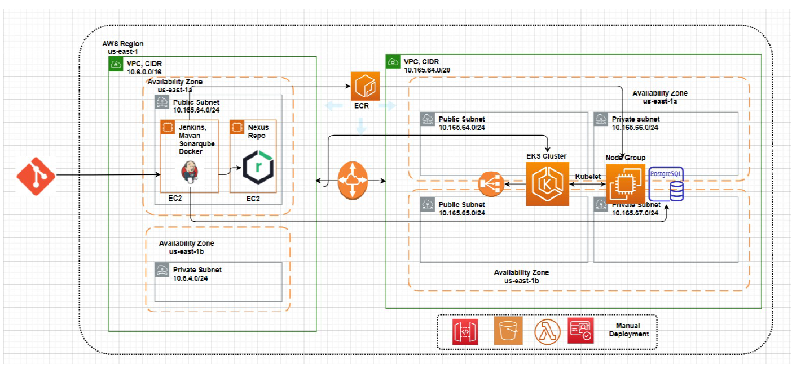
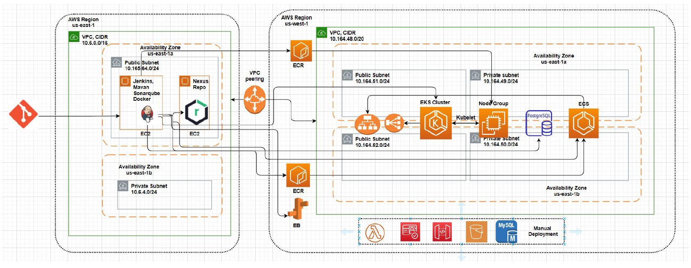
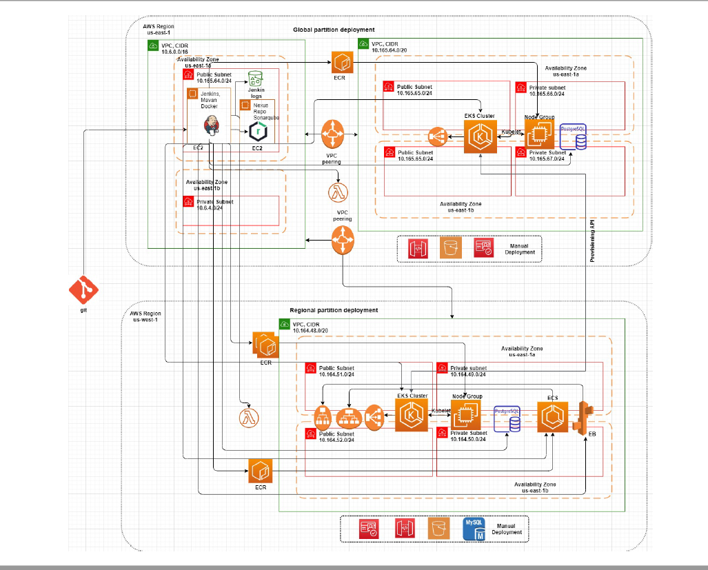

# AWS Deployment design
The deployment has two phases of deployment one is Global deployment and Regional deployment, we are using individual AWS regions for Global and Regional like us-west-1 for Global and us-west-2 for Regional, we installed DevOps tools like Jenkins, nexus, sonar in  one Global partition vpc and did vpc peering with deployment global vpc and deployment regional vpc. Using two availability to make system highly available, hosting database in private to keep secure, deploying load balancers in public subnets to give public access ( to provide access to other systems like carOTA...etc )

 Dev global partition deployment

 

 Dev regional partition deployment

 

 Global and Regional deployment

 