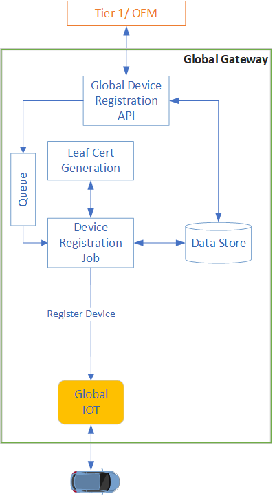
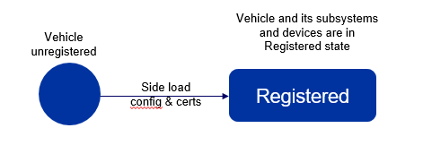

## What is Device Registration

Connected Vehicles (CVs) are equipped with advanced communication and other technologies, hardware that allow the exchange of information between vehicle and cloud. 

Each Connected vehicle has advanced communication modules, infotainment, driver assistance hardware manufactured from differnt or same OEM (which are called as Tier1/Tier2 OEM for eg: Bosch,Herman etc). 
Qualcomm is a leading manufacturer of semiconductor chipset(System on Chip) which are basic building block of OEM hardware.
Tier-1 or Tier-2 integrates Qualcomm chipsets along with other specified SW/HW modules based on vehicle OEM rquirement.

Qualcomm C2C platform has 2 components.First one is software agent(C2C Edge) on T1 hardware which enables Qulcomm chipset enrollment & activation. Other components hosted in cloud which enables repective workflows in cloud(C2C Cloud). 

<!-- Tier1/Tier2 hardware and firmware implementations are called as Tier1/Tier2 SDK(superset functionalities). Qualcomm chipset and software features are enclosed as a part of Tier1/Tier2 SDK. Hence Qualcomm cannot control what they provide to Tier1/Tier2 to get implemented inside the device. -->

To experience the functionalities of features provided by the C2C platform the device need to be enrolled and validated by the credentials.
These credentials are in the form of mutulaly agreed certificate files uploaded externally by vehicle OEMS(for eg: Tesla, Nissan etc).

The process of uploading the certificates files happen before manufacturing of vehicle and performed offline by car OEM.This step is referred to as sideloading operation.
All pre-requisite certificates files are present on the T1/T2 device SDK software at agreed location. The device is termed to be registred with C2C Platform.

<!--once it is enrolled to back end system(C2C Platform), device identity is hosted in C2C cloud platform and the required certificate/configuration files are present-->

<!--To ensure everything mounted on device correctly , registration is done first and provisioning to confirm what send at time of registration is validated at time of provisioning. As a pre-manufacturing step, OEM/Tier 1 entity will gather details e.g. how many devices, hardware architecture and other diverse details required to complete the manufacture process of the device and deliver it. Some of the details will be provided by the C2C (Car to Cloud) Platform. Hence, the manufacturer has to register / enroll the devices with the platform and receive data for side loading operation-->

## How Registration works 

<!--## Cloud side
-->

<!--Device Registration happens before the manufacturing of device mostly and it is an offline process. Device as an entity will not take part in this operation at all. Through the registration process, device is enrolled to back end system(C2C Platform) and device identity is hosted in platform.-->

<!-- These are implementation details. Please confirm do we need this?-->
Registration process is initiated by OEM in single or mass registration mannner depending on Vehicle make / model during manufacturing end of line of vehicle using C2C platform registration end point.
Registration will ensure that the device is enrolled in to the C2C Platform and device identity is hosted in the platform. 
As part of the process, system will generate the credentials (certificates if required) needed by device for authentication and establish connection to C2C cloud platform which will be side loaded into the device. Once all the required configurations and credentials are pushed to device ,the device is said to be registered.

<!--C2C Platform provides a mechanism to support registration of those devices in single & bulk manner. 

* As part of device registration OEM/Tier1 send the single or bulk device details to C2C Platform 
* C2C Platform stores the device details in Global device data store 
* C2C Platform generate the credentials and using this the identity of device is created in platform.This helps for future authentication and establishing connection with platform.
* OEM / Tier 1 will receive below details for every device to be side loaded. Device is registered once all the below details are pushed to the device
	+ IoT Gateway Connection endpoint 
	+ Attestation details (if generated) 
	+ Registration Status 
	+ Device metadata -->

 

### Side load Configuration details

Sideload configuration file contains Vehicle / Tier-1 OEM centric parameters. These parameters are 
C2C cloud connection endpoint/url, Credentials details (certificate file). 

C2C Edge software agent will use the sideload configuration details to accomplish the provisioning workflow.
  
  <!--Registration Status
	+ Device metadata-->

<!--OEM/Tier1 will register the devices by invoking registration interface of C2C platform and devices will be connecting to C2C Platform. As part of registration, a tracking identifier will be
send back to device. Using this identifier,OEM user can know the status of registration and will be able to download the registration details. OEM consume these downloaded data and will be pushed to device which is called as side loading operation.
Device will use the side loaded details later in connecting with C2C platform, authentication and other operations 

* OEM / Tier 1 will receive the below details for every device to be side loaded 
	+ IoT Gateway Connection endpoint
	+ Attestation details (if generated)
	+ Registration Status
	+ Device metadata

<!--## Device Side
Device Registration is an offline process and device does not have any role in this process. Once OEM/Tier invoke the registration process it will generate certificates, side load configution file, C2C configuration file (It will be part of C2C deployment package).
Device will be in unregistered state now. Once the below files are present in the device, the device is said to be registered

* C2C Configuration file
* Side Load Configuration file
* Certificates

-->
 

## Reference
     1. Registration Sequence Diagram - <https://cognizantonline.sharepoint.com/:b:/r/sites/QCC2CLeadsCognizant/Shared%20Documents/Sequence%20Diagram/DeviceRegistration.pdf?csf=1&web=1&e=gjgScU>{target=_blank}
     2. Product requirement document - https://cognizantonline.sharepoint.com/:w:/r/sites/QCC2CLeadsCognizant/Shared%20Documents/PRD/QC%20C2C%20PRD%20Draft%20v1.8.docx?d=w7e8e081a10fb44309f493d2a8ce78712&csf=1&web=1&e=J3fVDg
	 3. Architecture document - <https://cognizantonline.sharepoint.com/:w:/r/sites/QCC2CLeadsCognizant/Shared%20Documents/Architecture/Architecture_v1.24.docx?d=wb8bf41c602cc4d149dceef231652c44d&csf=1&web=1&e=V7YwHS>{target=_blank}

