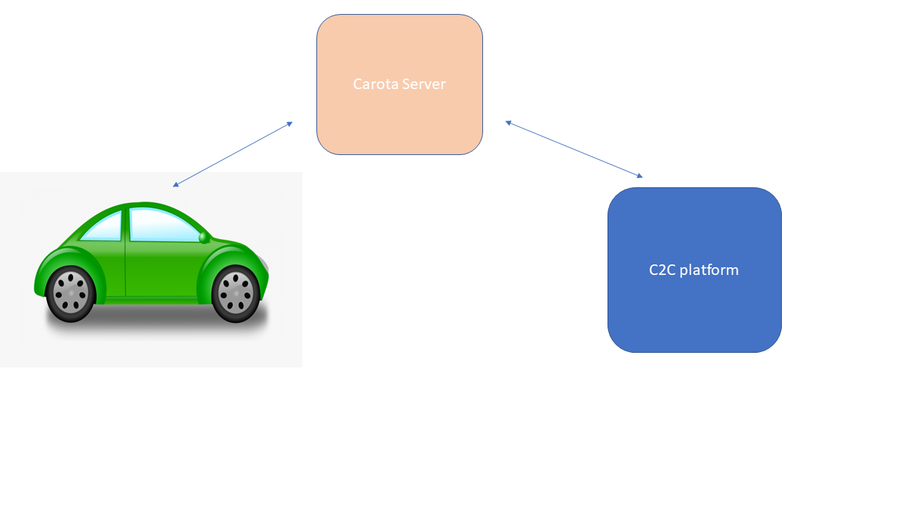

# Over the Air

## What is OTA Update 

OTA update are the software/firmware updates distributed wirelessly to already purchased vehicles. 

### Software updates (SOTA)

These updates are related to software that can control the vehicle's physical controls like geofencing,navigation & infotainment systems. In traditional approach, if there is a need to update the software the vehicle needs to be taken to the service station and get connected to the system/computer for an update.By OTA updates, OEMs try to install and update the software directly to the car over the air. These regular OTA updates help the OEMs to ensure the vehicle's correctness, efficiency, and reliability over the  lifetime of the vehicle. 

### Firmware updates (FOTA) 

These updates are applied to the firmware or system. Most common FOTA update is refreshed map information for the navigation system, audio upgrades etc. FOTA upgrade involves firmware bug fixes, improving the automotive ECU’s functionality, and security patch updates. It also ensures vehicle safety at highest possible level by optimising ADAS and other driving-related features such as steering and braking management.

### Why need OTA

* ECUs inside vehicle deal with multiple lines of code(min 100 +) and all these components require regular updates/upgrades. 
* Physical/Manual updates are difficult because of 
    + Cost
    + Inconvenience caused to end users
* Hence there is a need to remotely manage & update automotive ECU Software

## How it works

 

* C2C platform also offers OEMs option to publish new update or the new version of the software/firmware in the cloud server. 
* OEMS can also schedule data campaigns for sending the firmware/software updates to target vehicles. 
* The Carota server stores all the information related to the devices in the system such as the current status and the existing version of the firmware in use, within a large database. 
* C2C platform manages the process of triggering the update campaign for firmware/software updates. 
* The vehicles pull the upgrades from the Carota server over a secure wireless (Wi-Fi/ Bluetooth) connection based on defined set of pre-conditions. 
* Consumers can download, install/update and reboot system to experience OTA updates
* If OTA update fails, the system state will roll back to previous one.

## OTA Benefits

* Over the air implies that updates can be installed anywhere anytime 
* Efficient and Cost effective - By eliminating the need for software-related recalls and make software updates easy and seamless. 
* Protects from potential security attacks
* Increased value - By consistently maintaining in-vehicle software systems with OTA updates, the overall value of the car increases and opens new revenue opportunities to
automakers.

## Reference

