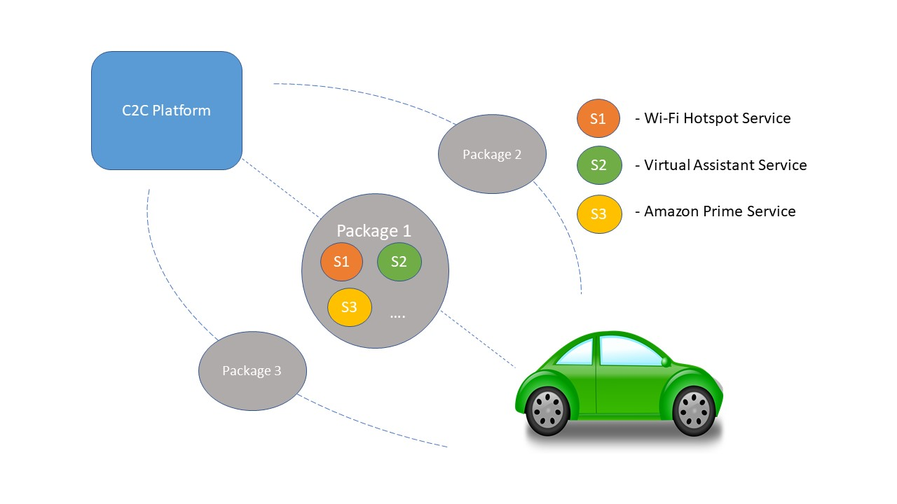

## Overview

The Car-to-Cloud platform offers a service management layer to empower OEMs in deploying and managing services in their customer's vehicles. 
This offers them to easily expand the services that create mesmerizing consumer experience, as well as to generate new revenue opportunities.  

Using C2C platform, OEMs can provide different Packages (A Package is a collection of services, For. E.g, Wi-Fi HotSpot enablement, Virtual Assistant Service etc. ), 
based on an Offer or a Subscription model to the consumers. For a consumer to experience a service, the features linked to the service must be enabled via soft SKU, OTA update or combination of both. 

### Monetization Options 

* Subscription - A subscription business model is a recurring revenue model in which customers pay a weekly, monthly, or yearly fee in exchange of products or services. OEMs configure the Data Limit, expiration time and the number of devices that can be connected to experience the services. Consumers can renew their subscription as and when the notification pop up appears for renewal based on different plans. 

* Offer - Certain services are offered for free for high end market segments. These services can be enjoyed by the consumers for the vehicle lifetime.

 

C2C platform solution help the automakers to provide their customers with many opportunities, which includes

* A rental car company providing Wi-Fi HotSpots as an upgrade option
    + Service Description
        - The Company presents the customer with an offer to upgrade to WiFi hotspot package bundled with the Data package in the rented car
        - Customer accepts the offer
        - Wi-Fi HotSpot is enabled
        - Highest data rate is chosen intelligently based on availble MNO capabilities in customers driving area 
    + Monetization Options 
        - Customer is charged for Wi-Fi HotSpot package subscrition for the rental
        - This package may also be bundled with other services for highend customers
* A dealer providing a virtual assistant bundled with a data package as part of the automobile’s MSRP
    + Customer upon accepting the Virtual Assistant Service, offered by the OEM, can experience this service with the existing hardware
    + One time or reccurring charges can be added to the customer bill. This can also be offered for free for high end market segments
* A consumer accepting a trial offer for a sponsored music application    
