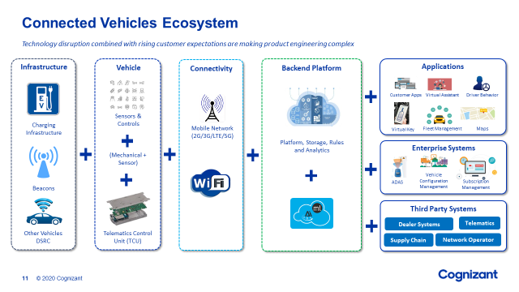

# Overview

The Qualcomm® Car-to-Cloud Platform is an integrated, flexible services suite for today’s connected cars. By using our wide range of automotive technology assets, IP, and expertise in complex systems engineering, the Qualcomm Car-to-Cloud Platform is designed to help automakers improve cost efficiencies, create service revenue opportunities throughout a vehicle’s lifecycle and provide advanced user experiences for customers and drivers. The Qualcomm Car-to-Cloud Platform also provides automakers the opportunity to unlock new revenue streams throughout the lifecycle of a vehicle with over-the-air (OTA) updates, on-demand unlocking of features, bundled as well as pay-as-you-use services, while gathering valuable vehicle and usage analytics.

## Product Value Proposition

* **Future-proof design for fast deployment timeframes** - Implement features now, with the ability to upgrade throughout the lifetime of the vehicle. Activate only when needed with opportunities to sell on-demand services to customers 
* **Cost-efficient operation** - Cost-efficient connectivity services and over-the-air updates, recall/warranty management, and pay-as-you-use for hardware, software and services. 
* **Actionable insights** - Opportunity to receive insights about application and feature usage, and make informed decisions based on monitoring hardware and feature usage 
* **New services and revenue opportunities** - New connected services, on-demand services for car sharing and Car as a Service (CaaS) and upsell opportunities after lease return. 
* **Personalized user experiences for passengers** - Flexibility to design unique experiences based on insights and analytics, plus segmented bundled content, app and services creating new potential revenue streams. 
* **Integrated connectivity** - Global operators for bootstrap connectivity, regulation compliance and integration with local operators, and differentiate traffic for sponsored connectivity offerings. 
* **Security & attested communication** - Anchored by secured keys in Qualcomm Technologies’ chipset hardware and Qualcomm Car-to-Cloud secured server infrastructure. 
* **Content, services and application bundling** - New ecosystem of pre-integrated partners provides for flexible packages for both personal and enterprise buyers. 

## Stakeholders and Use Cases
   * **Automotive OEM** - Company / organization who designs and manufactures car/vehicle. For instance: Nissan, Suzuki
   * **Automotive Tier-1 ODM**  - Company / organization who designs sometimes manufactures connected car device mounted in side the vehicle. This device may have multiple software and hardware interfaces. For instance: Bosch, Sony
   * **Automotive Tier-1 OEM** - Company / organization who manufactures connected car device mounted in side the vehicle. Most of the cases Tier-1 OEM controls software specifications on the connected car device. For instance: Harman.
   * **Chipset OEM** - Company / organizations who designs/manufactures low level chips, System on Chips

<!-- ## Roadmap

=== "Quarter 1" 
    * Basic Edge Software
        + Communication Library
	+ Device Life Cycle Management (Registration, Provisioning)
	+ Distributed / modularized device managers (SoftSKU)
    * Basic Cloud Platform
        + Communication Core
	+ Adaptor pattern based integration
	+ Cloud infrastructure agnostics (Q1: AWS)

	-->
	
