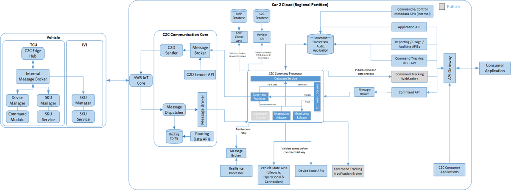
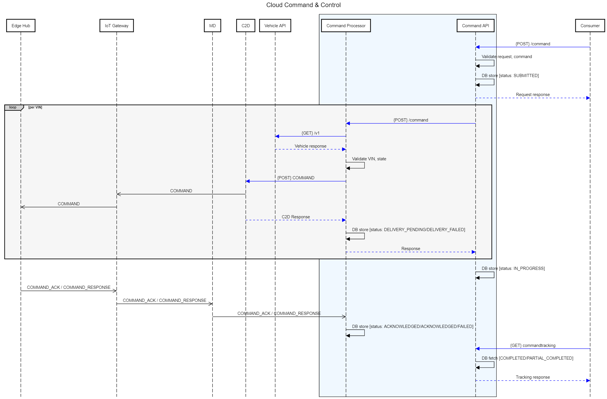

# Command & Control

## Workflow



## Sequence Diagram



## Command APIs

**Message Name** - Command APIs<br>
**Description** - APIs to facilitate invoke & track the command in C2C Platform. <br>
**Source Application** - Consumer application<br>
**Structure** - Json<br>

**APIs**

Below APIs will be used by the Consumer application to send & track the command to the vehicle / device. <br />

1.  __Endpoint__: https://{server}/v1.0/command <br>
    __Method__: POST <br>
    __Description__: API to be used by the consuming applications to invoke the command

    ```json title="Request" linenums="1"
    Headers: accept, content-type, content-length, authorization-token
    {
    	"appid": "<application id>",
    	"name":"<name for the command, consumer provided value>",
    	"ccid":100, // Refer Command and control Enum
    	"payload":{ // Contains the command to execute
      		"key1":"value1",
      		"key2":"value2",
    	}, 
    	"target": { // any 1 of the below targets can be provided.
        	"vins": ["vin1", "vin2"], //Currently we have set size 50 limitation for this, this should be configurable and get validated
        	"sysids": ["sysid1", "sysid2"], //Currently we have set size 50 limitation for this, this should be configurable and get validated
        	"groups": ["groupid", "groupid"] //Not in scope consideration
    	},
    	"timeout": -1  // Optional field. Default -1 NO Timeout, +ve value - Timeout in seconds, comand message will timeout after that duration. 
    }
    ```
    ```json title="Response" linenums="1"    
    {
        "responseCode": "<code>", // Response code/codes of the current request execution. Respective message will be present in the Error Codes dictionary.
        "responseData": {
            "trackingId": "<request id>", // A unique value, generated for tracking of the issued command.
            "status": 1  //Refer Command tracking Status Enum. Typically it will be always 1 as SUBMITTED.
        }
    }
    ```
    ```json title="Validation"
        Validation - 
        * appid - Mandatory check and valid appid check.
        * name - mandatory and length check
        * ccid - mandatory check
        * payload - mandatory check
        * target - mandatory check atleast 1 target should be added.
                   Max elements in any selected target is configurable.
                   if VIN - Validate individual VIN 
                   if SYSID - Validate individual SYSID .  
                   if groupid - validate individual groupid 
        * timeout - default is -1.
    ```


2.   __Endpoint__: https://{server}/{version}/commandtracking/{trackingId} <br>
    __Method__: GET <br>
    __Description__: API to track the requested command status and response payload for completed status

    ```json title="Request" linenums="1"
    Request Headers: accept, authorization-token, x-requestor, app-id

    ```    
    
    ```json title="Response" linenums="1"    
    Headers: accept, content-type
    Response:
    {
        "responseCode": "<code>", // Response code/codes of the current request execution. Respective message will be present in the Error Codes dictionary.
        "responseData": 
        {
            "trackingId": "<request id>",
            "name":"<name of the command given when invoking Command API>", 
            "trackingStatus": 1, // Refer Command Tracking status Enum
            "data": //Array of VIN number. Support for future.
            [
                {
                    "vin":"<targetted VIN>",
                    "systemId":"<targetted systemid>",
                    "status": 103, //Refer Command Status Enum
                    "responsePayload":"", // Present only if the execution is COMPLETED status. Payload will be base64 encoded string provided by executor.
                }
            ]
        }
    }
    ```

3.   __Endpoint__: https://{server}/{version}/commandtracking/{trackingId}?vin={vin} <br>
    __Method__: GET <br>
    __Description__: API to track the requested command status for the specified vin

    ```json title="Request" linenums="1"
    Request Headers: accept, authorization-token, x-requestor, app-id
    
    ```    
        
    ```json title="Response" linenums="1"    
    Headers: accept, content-type
    Response:
    {
        "responseCode": "<code>", // Response code/codes of the current request execution. Respective message will be present in the Error Codes dictionary.
        "responseData": 
        {
            "trackingId": "<request id>",
            "name":"<name of the command given when invoking Command API>", 
            "trackingStatus": 1, // Refer Command Tracking status Enum
            "data": //Array of VIN number. Support for future.
             [
	       {
                    "vin":"<Requested VIN>",
                    "systemId":"<Requested vin's systemid>",
                    "status": 103, //Refer Command Status Enum
                    "responsePayload":"", // Present only if the execution is COMPLETED status. Payload will be base64 encoded string provided by executor.
               }            
	     ]
        }
    }
    ```

4.   __Endpoint__: https://{server}/{version}/commandtracking/{trackingId}?sysid={systemid} <br>
    __Method__: GET <br>
    __Description__: API to track the requested command status for the specified system Id

    ```json title="Request" linenums="1"
    Request Headers: accept, authorization-token, x-requestor, app-id
    
    ```    
        
    ```json title="Response" linenums="1"    
    Headers: accept, content-type
    Response:
    {
        "responseCode": "<code>", // Response code/codes of the current request execution. Respective message will be present in the Error Codes dictionary.
        "responseData": 
        {
            "trackingId": "<request id>",
            "name":"<name of the command given when invoking Command API>", 
            "trackingStatus": 1, // Refer Command Tracking status Enum
            "data": //Array of VIN number. Support for future.
	    [
               {
                    "vin":"<Requested VIN>",
                    "systemId":"<Requested vin's systemid>",
                    "status": 103, //Refer Command Status Enum
                    "responsePayload":"", // Present only if the execution is COMPLETED status. Payload will be base64 encoded string provided by executor.
               }
	    ]
        }
    }
    ```


## Command Message

**Message Name** - Command Message<br>
**Description** - A message sent from cloud to device with the requested command. <br>
**Source Application** - Cloud<br>
**Target Application** - Device<br>
**Structure** - Json<br>

**Message**

```json title="Command Message" linenums="1"    

{
 "message_id": 1234,
 "correlation_id": "",
 "version": "v1/v2",
 "system_id": "c2c-sys-uniqueid",
 "sub_system_id": "c2c-sub-uniqueid", 
 "vin": "**vehicle identifier**", //removed from v2
 "device_id": "**device identifier **", //primary device_id
 "ecu_type": "**ecu type**",  //removed from v2
 "source_id": "c2c-cloud",
 "target_id": "DM",
 "message_type": "COMMAND", // 251 for v2
 "time": 1624515332856, // epoch time (milliseconds)
 "ttl": -1,
 "status": "SUBMIT",  //removed from v2
 "property_bag": {
	"body_encoding_type": 1,
	"ack_required": 1,
    	"checksum":"" // optional
 },
 "body": {
  "ccid":100,
  "transId":"sampleTransId", //message_id value is passed here
  "precondition":{    
    "critical":0,
    "checkconn":0
  },
  "postcondition":{
    "doorLocked":true
  },
  "input":{ //It is the payload of the CC request API
    "all":true,
    "frontLeft":false
  }
 }
}

```

**Body**

|Attribute Name|Datatype|Mandatory| Length (bytes) |Description|
| :------------- | :------------ |:------------ |:------------: |:------------ |
| name| String| Yes| 20| Name of the command. Consumer provided name for the command. This name is for tracebility purposes. No relation to the actual command or operation happening. |
| transId| String| Yes| 23| Transaction id for the per vin Command operation.|
| ccid| Numeric| Yes| | Refer [Command Category Enum](#command-&-control-eum) |
| precondition| Json | Yes| | Command specific predefined precondition |
| postcondition| Json | Yes| | Command specific predefined postcondition |
| input| Json | Yes| | Payload object provided to command request API |


## Command Acknowledgement

**Message Name** - Command Acknowledgement<br>
**Description** - A message sent to cloud as an acknowledgement of the received command. <br>
**Source Application** - device<br>
**Target Application** - cloud<br>
**Structure** - Json<br>

**Message**

```json linenums="1"    

{
 "message_id": 1111,
 "correlation_id": 1234,
 "version": "v1/v2",
 "system_id": "c2c-sys-uniqueid",
 "sub_system_id": "c2c-sub-uniqueid", 
 "vin": "**vehicle identifier**",  //removed from v2
 "device_id": "**device identifier **", //primary device_id 
 "ecu_type": "**ecu type**",  //removed from v2
 "source_id": "c2c-edge",
 "target_id": "c2c-cloud", 
 "message_type": "COMMAND_ACK", // 252 for v2
 "time": 1624515332856, // epoch time (milliseconds)
 "ttl": -1,
 "status": "SUBMIT",  //removed from v2
 "property_bag": {
	"body_encoding_type": 1,
	"ack_required": 1,
    	"checksum":"" // optional
 },
 "body": // Below object will be base64 Encoded String
 { 
	"transId": "",   // Transaction id to track the command for every VIN. Here the value will be correlation_id
	"ackTime": 11111111 // Current time when command was acknowledged (epoch time in milliseconds)
 }
}

```

**Body**

|Attribute Name|Datatype|Mandatory| Length (bytes) |Description|
| :------------- | :------------ |:------------ |:------------: |:------------ |
| transId| String| Yes| 23| Transaction id for the per vin Command operation.|
| ackTime| Numeric | Yes| | Time when the message was acknowledged. Added this attribute to ensure no failures on C2C Communication Core. (epoch time in milliseconds)|


## Command Response

**Message Name** - Command Response<br>
**Description** - A message sent to cloud as response of the received command. <br>
**Source Application** - device<br>
**Target Application** - cloud<br>
**Structure** - Json<br>

**Message**

```json title="Command Message Response" linenums="1"    

{
 "message_id": 2222,
 "correlation_id":1234,
 "version": "v1/v2",
 "system_id": "c2c-sys-uniqueid",
 "sub_system_id": "c2c-sub-uniqueid", 
 "vin": "**vehicle identifier**", //removed from v2
 "device_id": "**device identifier **", //primary device_id 
 "ecu_type": "**ecu type**",//removed from v2
 "source_id": "DM",
 "target_id": "c2c-cloud", 
 "message_type": "COMMAND_RESPONSE",  // 253 for v2
 "time": 1624515332856, // epoch time (milliseconds)
 "ttl": -1,
 "status": "SUBMIT", //removed from v2
 "property_bag": {
	"body_encoding_type": 1,
    "checksum":"", // optional
	"ERROR_CODE":<respective_err_code> // optional. Only if there is an error
 }
 "body": // Below object will be base64 Encoded String
 {
     "transId": "",   // Transaction id to track the command for every VIN. Here the value will be message_id
     "responseTimestamp": 1624515332856, //Current time when response payload was received by DM. epoch time (milliseconds)
     "output":  // validation would be based on configurable flag
     {
	   "statusCode":0, // 0-success, 1-fail
	   "responsePayload": {} // Payload will be base64 encoded string provided by executor. 
	   "error": 
	   {
		 "code": 111
	   }
	 }
 }
}

```

**Body**

|Attribute Name|Datatype|Mandatory| Length (bytes) |Description|
| :------------- | :------------ |:------------ |:------------: |:------------ |
| transId| String| Yes| 23| Transaction id for the per vin Command operation.|
| responseTimestamp| Numeric| Yes| | Time when response was generated/received.|
| output| Json| Yes| | Result of the command execution. It is intended for the consumer who initiated the command. Validation would be based on configurable flag |


## Additional Info

### Command & Control Enum

Below are the categories of commands. Ideally these will be modules present in the vehicle to manage specific commands in the category / individual commands.

| CC ID| Commands | Description|
| :------------- | :------------ |:------------ |
| 100| Transmission Control| |
| 200| Vehicle Control| Breaking, Throttle etc.|
| 300| Signal & Lighting| Indicators, lights, internal lights, display etc.|
| 400| Instrumentation| Speedometer, Tachometer, Odometer, Fuel gauge, Engine temperature gauge, Ammeter, Oil pressure gauge etc.|
| 401| HVAC_CONTROL| |
| 500| Remote Services| Remote control services of vehicle. Door lock/unlock, window lock/unlock, Remote start/stop etc.|
| 501| DOOR_CONTROL| |
| 502| DOOR_TRUNK_CONTROL| |
| 503| WINDOW_CONTROL| |
| 600| Parental Control| |
| 700| Maintenance| |
| 800| Location Services| |
| 900| Security| |
| 1000| Safety| |


### Command Tracking Status Enum

| Status ID| Status Name| Description|
| :------------- | :------------ |:------------ |
| 1| SUBMITTED| Command submitted in queue to be processed. This status is at COMMAND request level.|
| 2| INPROGRESS| Command execution is in progress. This status is at COMMAND request level.|
| 3| COMPLETED| Command invocation complete. This status is at COMMAND request level.|
| 4| FAILED| Any other failure. |
| 5| PARTIAL_COMPLETED| Command invocation not completed for all targets. This status is at COMMAND request level.|

### Command Status Enum

| Status ID| Status Name| Description|
| :------------- | :------------ |:------------ |
| 101| DELIVERY_PENDING| A command (for a specific vehicle) is handed over to C2D Sender by C2C Command Processor. This status is at per vehicle command level. |
| 102| ACKNOWLEDGED| When vehicle acknowledges the command. This status is at per vehicle command level. |
| 103| COMPLETED| Command Execution completed and response is received to C2C Command Processor. This status is at per vehicle command level. |
| 104| DELIVERY_FAILED| If command not delivered to underlying vehicle. This status is at per vehicle command level. |
| 105| FAILED| Any other failure. This status is at per vehicle command level. |
| 106| TIMED_OUT| When command is timed out at Cloud. This status is at per vehicle command level. |
