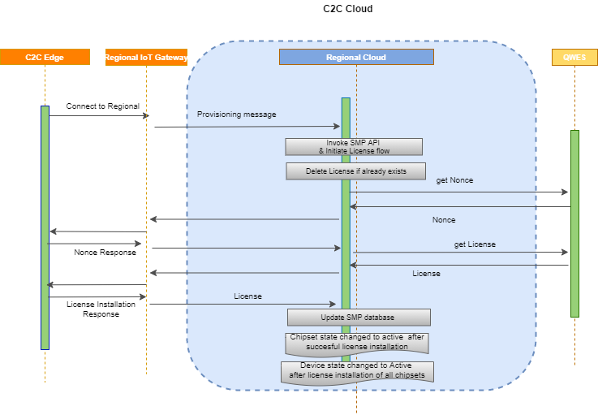

# License Installation

## Workflow

Qualcomm  provide platform license using which manufacturer can test the all features of combinations of chipset and confirm it is working fine .Now every vehicle need to have device specific license (i.e. replace platform license with device specific license) for dynamically controlling features and experiencing it. 

To dynamically control , SKU has a license mechanism which generate device specific license.The SKUs will be created by defined guidelines that resides inside Config tool. After this step the SKU need to be mapped to corresponding OEM.  An OEM will be defined and a program will be created for that OEM for e.g  for ECU type or vehicle. Program will be associated with program version, chipsets and a program name. For each program version, service package for each chipset will be defined .
 
 Per chipset service package, the SKUs and  the values of the  features will be defined. As part of device onboarding,  these SKUs will be applicable  to C2C Platform for SKU updates and there will be a default SKU defined . 
 
A default SKU will be associated with program or platform license file for which chipset specific license will be generated from Qualcomm System so that the configurations specified in license file will be enabled and user can experience those features. Features will be updated in alacarte fashion from other user portals.

The license generation workflow is defined in the below steps: 

1. Initiate License Flow : Once the chipset is onboarded in the C2C platform, the SMP component inside C2C platform initiate the 
   license generation flow to LMS for that particular  chipset.
2. Delete License : LMS component of C2C Platform connect to QWES using cognito authetication and request QWES to delete license if any already exists for that chipset
3. Request Nonce & Nonce Generation : LMS component of C2C Platform request QWES to generate nonce and send the nonce to 
device for retrieving the attestation report which is required for license generation
4. Nonce Response : Device acknowledge the nonce response which contain the attestation report and LMS component send this report, features etc to QWES 
5. License Request & Generation : QWES generates the license for the features of that chipset and pass over to LMS which inturn send back to device for installaion.
6. License Installation Response : At Device side the chipset specific license will be installed and it replaces the platform license file. 
   Here after configurations specified in license file will be enabled and user can experience those features
   Device will be send back installation reponse to C2C platform 
7. Update SMP data store : C2C Platform store the license details and  license installation status in data store
8. Change chipset state to "Active: : Once license is installed successfully the chipset state is changed to "Active"
9. Change Device state to Active" : Once license of all chipsets are installed succesfully, the device state is chnaged to "Active"

{!messagestructure//chipsetnonce.md!}

{!messagestructure//chipsetnonceresponse.md!}

{!messagestructure//smptolmsinstalllicensedata.md!}

{!messagestructure//chipsetinstalllicense.md!}

{!messagestructure//chipsetinstalllicenseresponse.md!}

{!messagestructure//activatechipset.md!}

{!messagestructure//chipsetupdatelicense.md!}

{!messagestructure//chipsetupdatelicenseresponse.md!}

{!messagestructure//smptolmsdeletelicensedata.md!}

{!messagestructure//deletelicense.md!}

{!messagestructure//deletelicenseresponse.md!}

