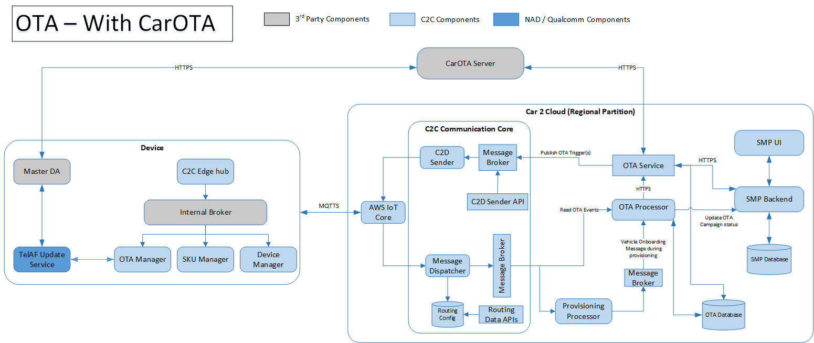

# OTA Operations

## Workflow



## CarOTA Server Event

**Message Name** - CarOTA Server Event<br>
**Description** - CarOTA server will raise a event when a schedule for OTA is triggered. <br>
**Source Application** - CarOTA Server <br>
**Target Application** - OTA Adapter<br>
**Structure** - Json<br>

**Message**

```json
API: https://<server>/v1.0/ota/trigger
 Method: POST
 Headers: accept, content-type, content-length, authorization-token
 {
   "time":1625660275379,  
   "version": “v1”,
   "body":
	  {
		"model" : "vehicle model a",
		"ref-id": "schedule 0909",
		"script-ref-id" : "hu only 001",
		"vins": [
			"5YJSA1E40FF345678",
			"5YJSA1E40FF345679",
		]	
	  }
  }
```


## OTA TRIGGER

**Message Name** - OTA TRIGGER<br>
**Description** - CarOTA server will raise a event when a schedule for OTA is triggered. This event will be listened by OTA Adapter and it will send the message to each vehicle via C2DSender with only one vehicle data in the body. <br>
**Source Application** - Cloud<br>
**Target Application** - Device<br>
**Structure** - Json<br>

**Message**

```json
{
    "message_id": "msg-cld-uniqueid",
    "correlation_id": "",
    "version": "v1",
    "system_id": "c2c-sys-uniqueid", //based on the VIN
    "sub_system_id": "",
    "vin": " **vehicle identifier**",
    "device_id": "**device identifier **", //populate the primary device id
    "ecu_type": "**ecu type**", // populate the primary device type
    "source_id": "c2c-otaadapter",
    "target_id": "c2c-edge",
    "message_type": "OTA_TRIGGER",
    "time": 1620891851,
    "ttl": -1,
    "status": "SUBMIT",
    "property_bag": {
        "body_encoding_type": 1, 
        "ack_required": "1" 
    },
    "body": // Below object will be base64 Encoded String
    {
		"model" : "vehicle model a",
		"ref-id": "schedule 0909",
		"script-ref-id" : "hu only 001",
		"vin": "5YJSA1E40FF345678"
	}
}
```

**Body**

|Attribute Name|Datatype|Mandatory| Length (bytes) |Description|
| :------------- | :------------ |:------------ |:------------: |:------------ |
|model|String|Yes| |  |
|ref-id|String|Yes| | |
|script-ref-id|String|Yes| | |
|vin|String|Yes| | 17 |


## OTA TRIGGER Acknowledgement 

**Message Name** - OTA TRIGGER ACKNOWLEDGEMENT<br>
**Description** - Acknowledgement for OTA Trigger <br>
**Source Application** - Device<br>
**Target Application** - Cloud<br>
**Structure** - Json<br>

```json

{
    "message_id": "msg-dev-uniqueid",
    "correlation_id": "msg-cld-uniqueid",
    "version": "v1",
    "system_id": "c2c-sys-uniqueid",
    "sub_system_id": "",
    "vin": " **vehicle identifier**",
    "device_id": "**device identifier **",
    "ecu_type": "**ecu type**",
    "source_id": "c2c-edge",
    "target_id": "c2c-otaadapter",
    "message_type": "OTA_TRIGGER_ACK",
    "time": 1620891851,
    "ttl": -1,
    "status": "SUBMIT",
    "property_bag": {
        "body_encoding_type": 1 
    },
    "body": // Below object will be base64 Encoded String
    {
    	acknowledge_time: 11111111 //Original component acknowledgement time in ms
    }
}

```
**Body**

|Attribute Name|Datatype|Mandatory| Length (bytes) |Description|
| :------------- | :------------ |:------------ |:------------: |:------------ |


## OTA Event

**Message Name** - OTA EVENT<br>
**Description** - Vehicle will send OTA status / consent / events to cloud using this message.<br>
**Source Application** - Device<br>
**Target Application** - Cloud<br>
**Structure** - Json<br>

```json
{
    "message_id": "msg-dev-uniqueid",
    "correlation_id": "msg-cld-uniqueid",
    "version": "v1",
    "system_id": "c2c-sys-uniqueid",
    "sub_system_id": "c2c-sub-uniqueid",
    "vin": " **vehicle identifier**",
    "device_id": "**device identifier **",
    "ecu_type": "**ecu type**",
    "source_id": "c2c-edge",
    "target_id": "c2c-otaadapter",
    "message_type": "OTA_EVENT",
    "time": 1620891851,
    "ttl": -1,
    "status": "SUBMIT",
    "property_bag": {
        "body_encoding_type": 1
    },
    "body": // Below object will be base64 Encoded String
    {
		"vin": "5YJSA1E40FF345678",
        "device_id": "device1234",
        "device_type": "TCU",
        "status": <Status ENUM>, 
        "meta": [
            { "key": "download", "value" : "40%" },
            { "key": "reason", "value" : "Network Failure" }
        ],
        "timestamp": <IVI/User response time/underlying sub component initiated time>,
        "ref-id": "schedule 0909"
	}
}
```

**Body**

|Attribute Name|Datatype|Mandatory| Length (bytes) |Description|
| :------------- | :------------ |:------------ |:------------: |:------------ |
|vin|String|No| 17 | |
|device_id|String|No| | |
|device_type|String|No| | |
|status|Numeric|Yes| | Refer OTA Event enum |
|meta|object|Yes| | key-value pair of additional data in relation to OTA event. Send empty if no additional data. |
|timestamp|Numeric|Yes| | Time in unix time when the message was received by OTA manager from underlying component. |
|ref-id|String|Yes| | |


## OTA Event Enum

|Value | Enum Name | Description|
| :---- | :----- | :----- |
|1|received|The download agent has received the update script|
|2|cancel|The user has cancelled the update|
|3|downloading|The update package begins to download|
|4|downloaded|The update package is downloaded to the device|
|5|reboot|The device begins to update|
|6|success|The device updates successfully|
|7|failure|The device fails to update|
|8|download_fail|The update package fails to download|
|9|md5_check_success|The update package passes MD5 check|
|10|md5_check_fail|The update package didn’t pass MD5 check|
|11|pki_check_success|The update package pass PKI verification|
|12|pki_check_fail|The update package didn’t pass PKI verification|
|13|rollback_success|The device rollbacks successfully|
|14|rollback_fail|The device fails to rollback|
|15|pause| pause the event activity|
|16|resume| resume the event activity |
|100|consent_accepted|User accepted from IVI APP|
|101|consent_rejected|User rejected from IVI APP|


