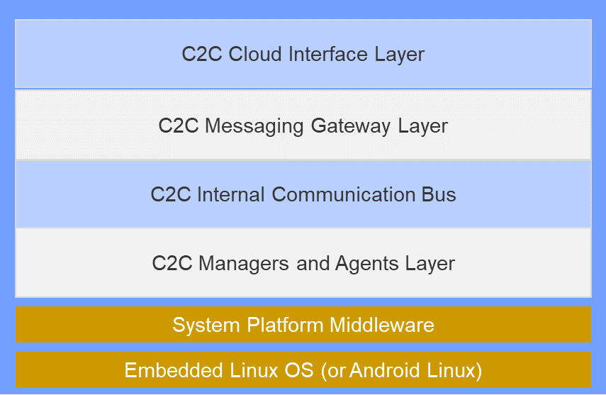
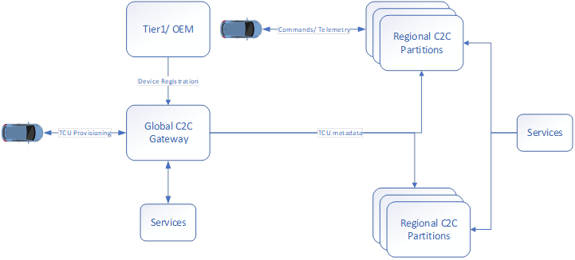

# Overview

Car-to-Cloud (C2C) is the connected car platform that is being built with Qualcomm chipsets. The platform consists of both cloud and device-side components, which should enable OEMs and other third-party entities to integrate their solutions, and deliver richer user experience from the car-to-cloud platform. Platform consists of services for Device Management, OTA, SoftSKU, Connectivity Management, Analytics Management etc. also hosts a single control & data path to and from the vehicle edge through C2C Edge and Communication core components.

C2C Platform comprises of  
### **C2C Edge**
An embedded middleware that resides on the Qualcomm chipsets for TCU, IVI and ADAS on the vehicle. It enables device side functions and host a communication channel.
    
{ width=450 }

Solution tenants:   

   1.	_Layered Architecture_: C2C Edge Architecture should be divided into logical and functional layers to enable adaptations which are inherent in the lifecycle of the C2C Edge deployment.    
   2.	_Configuration driven behaviors_: C2C Edge Solution may undergo a number of adaptations and customizations in its deployment path with each individual OEM but also along its development path. The customizations and adaptations are not generally expected to be at runtime, but rather at the time of deployment or hosting. Therefore configurability in the solution will help mitigate a number of customizations and adaptability requirements that might possibly come up.    
   3.	_Secure Communication_: The entire solution must adopt best practices in security in order to prevent malicious usage. C2C Edge solution will need to identify and implement measures to support end-to-end security.      
   4.	_Performance Monitoring / Profiling hooks_: Instrumentation for profiling of the core operations in the C2C Edge should be implemented, to identify the bottlenecks, if any. However, it should be possible to switch off the profiling at compile time for the production version.     
   5.	_Configurable Logging Levels_: Multiple logging level should be supported. It should be possible to change the logging level both statically and dynamically.     
   6.	_Decoupled and modular design_: Each component of C2C Edge should be loosely coupled with other components and comply with the defined interface.      
   7.	_Extensibility_: Integrating new services/partner solutions onto the C2C Edge must be supported through interfaces.   

### **C2C Cloud**
A cloud hosted components with will receive and communicate with Vehicles using a defined message structure. It hosts a central service which enables services to communicate with the vehicles. It also hosts other feature services and flows related to Device Management, service managmenet consisting of Soft SKU, package & services, OTA, diagnostic configuration management, remote vehicle commands, data analytics and vehicle services.

   

   +	**Global C2C Gateway** - It will handle registration (metadata from Tier1) for all vehicle modules and provisioning of primary ECU (TCU, IVI or ADAS) modules. Post provisioning, the ecu device will be rehomed to the regional partition where the provisioning of the rest of the modules will take place.
   +	**Regional C2C Gateways** - It will handle device provisioning and will host the in scope vehicles. Once provisioned all vehicles will communicate with this gateway and perform all operations. C2C communication core which is responsible for C2D and D2C message deliveries and routing. 

   Solution tenants:  

   1.	_Cloud agnostic_: Ensure that the solution can be deployed on various cloud platforms with minimal changes.      
   2.	_Highly available_: Ensure that the solution is designed to achieve TBD % availability   
   3.	_Scalable_: Solution should be able to scale horizontally to accommodate growth of users/devices/functionality    
   4.	_Microservices_: Microservices based architecture with event based decoupled ntegrations.    
   5.	_Security & Privacy_: Solution should ensure data security and privacy.     
   6.	_Operable_: Solution should emit health metrics/ application logs/ performance metrics in easily consumable format. These metrics should be fed into an analytics solution which supports viewing/ analyzing and alerting on this data    

