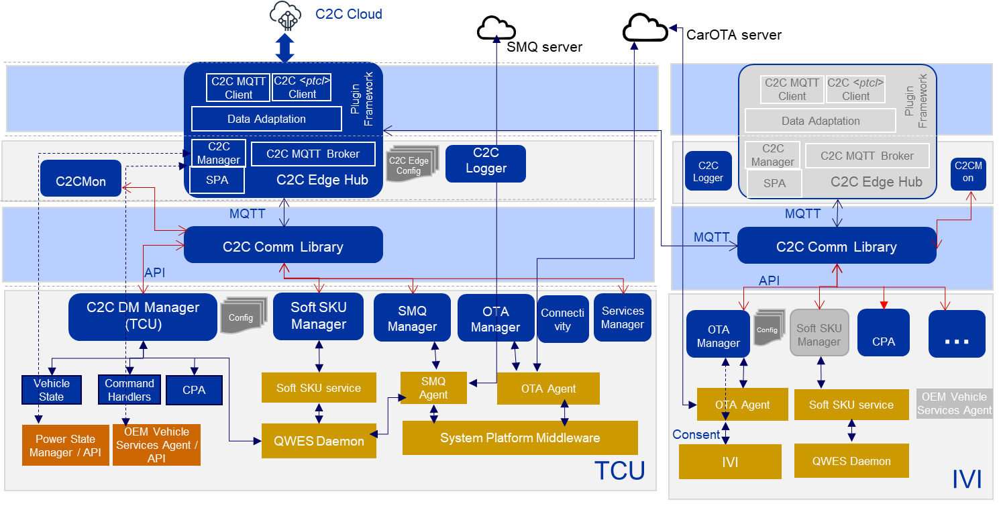
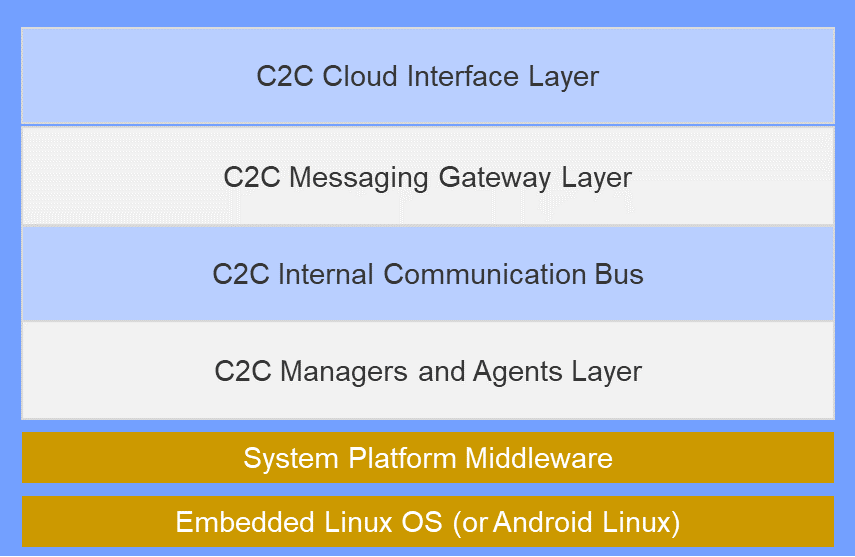
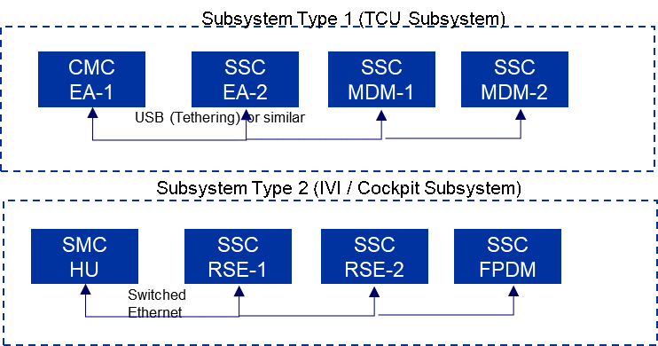

## Overview 
The objectives of the C2C Edge architecture are stated below : 

* **Data Flows** – The following mentions various data flows and their support in C2C Edge 

	1.	Control Path – Device Management	Messaging for Device Management 
	2.  Device Control, and Device Configuration.	YES 
	3.	Control Path – OTA	Messaging for OTA management	YES 
	4.	Control Path – SMQ	Control Path Messages for SMQ	YES 
	5.	Telemetry Data	Future Scope	YES 
	6.	Data Path – OTA	OTA File Packages is transferred directly between the OTA Agent and OTA Server over protocol such as HTTPS	NO 
	7.	Data Path – SMQ	Stats File is uploaded by SMQ Agent to the SMQ Server directly over protocols such as HTTPS	NO 
	8.	CAPS Data	Content and services data is transported to the Applications and Services on the IVI Unit and is not managed by C2C Edge	NO 
	
* **Cloud Agnostic** – The solution should be able to work with IOT Gateway being hosted on various cloud platforms such as AWS IoT, Azure IoT and GCP.
* **Support for multiple ECUs** – A vehicle could have one or more ECUs, viz. TCU, IVI and ADAS, based on Qualcomm chipsets. TCU in turn could be constitute of MDM and EA as separate ECUs.
* **Multiple ECU configurations** - Support of ECUs such as IVI and ADAS based on Qualcomm chipsets, with TCU based on non-Qualcomm chipset.
* **Integration** - Support partner solution integration for OTA, Connectivity etc.
* **Adaptation** - Support for adaptation to certain defined OEM adaptations
* **Portability** - Support for portability to various Operating Systems (Linux Embedded, Android Linux and UNIX-like) for OEM platforms.
* **Security** – Employ the best security practices for hardening of C2C Edge.s
* **Containerization** – Provision for containerization of C2C Edge for incorporation in response to the requirement definition at a later stage.
* **Protocol Adaptation** – Provision for adaptation for cloud communication, for messaging based protocols, for incorporation in response to the requirement definition at a lat

## Device Architecture
### Functional View

C2C Edge hub establishes the single control path between C2C cloud and the various services being run on all the ECUs on a vehicle. 
The edge hub receives messages from the C2C cloud and sends them on the internal communication service bus. 
The messages get serviced by appropriate managers, which in-turn communicate with the corresponding services for completing the necessary actions
A manager implements the interface to interact with the corresponding service. Only one instance of the C2C Edge hub will be running in a vehicle on any one of the ECUs that is marked primary 

The functionality of each of the blue-colored blocks presented in Figure are mentioned below:

* **C2C Edge Hub/Messaging Gateway** - It is responsible for connecting and maintaining a single control channel to C2C cloud for all Qualcomm agents. 
C2C Edge hub consists of below components : 
	+ C2C Cloud client - This component establishes and maintain the connection to the C2C Cloud. It also sends and receives the messages between device and cloud. 
	+ C2C Edge Hub – MQTT Broker - This module runs the MQTT broker for the internal service bus. 
	+ C2C Data Adaptation Layer – This module transforms the messages received on northbound interfaces to the required messaging format for the internal MQTT bus and vice versa. It also performs the mapping of Message Names (Topics) on the external interface to those on the internal communication bus
	+ C2C Manager – This module establishes & maintains the connectivity state of the primary ECU, verifies if the device has the necessary configuration/certificate files. It also implements various GET and SET APIs for C2C Edge configuration. 
	+ Subsystem Provisioning Agent(SPA) – It has a Subsystem Provisioning Agent sub-module that triggers the provisioning query message via Subsystem Provisioning Agent when primary ECU connects for the first time
	  SPA initiates connection to the regional C2C cloud upon provisioning query response and triggers the provisioning message  
* **C2C Edge Managers / Agents** 
	+ Device Manager(DM) - This module is responsible for all device management functions, obtaining the vehicle state, forwarding command/control messages and enabling the c2c services. 
	+ Soft SKU Manager - It is responsible for interfacing with SoftSKU service for SKU update message handling 
### Logical View

The above depicted Layered architecture enables to keep functionalities decoupled and modular, providing flexibility for adaptations during OEM integrations.
Following layers are part of the C2C Edge Architecture

* **C2C Cloud Interface Layer** - This layer communicates with the Cloud IOT / Services backend and also transforms the messages for consumption of C2C messaging gateway.
* **C2C Messaging Gateway Layer** - C2C Edge Hub is designed to be a Gateway for communication of messages between the C2C Managers and the cloud. 
* **C2C Messaging Gateway Layer** - This handles the communication between various components of the C2C Edge. 
* **C2C Managers / Agents** - C2C Clients are the main functional entities that implement the features of C2C. 

### C2C Edge Vehicle Schema 
Vehicle Network consists of a number of ECUs based on Qualcomm chipsets. However there is an inherent relationship between ECUs and this relationship needs to be considered for a number of functions such as Provisioning, SoftSKU Update
The different units of vehicle schema are mentioned below:

* **Chipset** - Chipset represents a hardware module that implements a unit of functionality, but is usually a part of Device or Subsystem. Each device may consists of multiple chipsets.
* **Device** - Device in simple terms refers to an ECU with a single chipset or ECU with multiple chipsets on board. Examples of Device are TCU, RSE1, RSE2
* **Subsystem** - Subsystem refers to a a group of Devices or Chipsets that perform a related function or are interdependent. Examples are Cockpit Subsystem with IVI, RSE1, RSE2 and HUD. 
* **System/Vehicle** - System is a logical grouping of all Subsystems within the vehicle that are based on Qualcomm chipsets. System and Vehicle are equivalent from the C2C Edge point of view

    Chipsets and their classification for C2C Edge  

CMC is the C2C Main Chipset, that hosts the C2C Edge Hub functionality. SMC is the Subsystem Main Chipset, that runs on the designated main chipset on the Subsystem. SSC is the Subsystem Secondary Chipset that is part of the Device or the Subsystem. 
The two types of subsystems are:

* **Subsystem Type1** - SMC and SSC are tightly coupled on the same hardware platform, manufactured and setup by same Tier1 through centralized or separate setup process. 
* **Subsystem Type2** - SMC and SSC are loosely coupled and are different hardware units, manufactured and setup by same Tier1 through separate setup process . 

### Configuration Files

* **Side Load Configuration** - Most of the details in side load configuration file are received as part of registration process. 

     The side load configuration contents are mentioned below:

      url_cloud=avyq8mqx1md7m-ats.iot.us-east-1.amazonaws.com

      url_device=localhost:1883

      client_id=device_connected_car

      CA_PATH=../certs/

      root_path=../certs/cacert.pem

      client_cert_path=../certs/clientcert.pem.crt

      priv_key_path=../certs/private.pem.key

      CLOUD_SUB_TOPIC=device/device_connected_car/in

      CLOUD_PUB_TOPIC=device/device_connected_car/out

      DEVICE_PUB_TOPIC=C2C_HUB/SEND/

      vehicle_state=REGISTERED_NOT_PROVISIONED

      system_id=c2c-00000001

      deviceId=device-101

      ecu_type=TCU

      source_id=c2c-edge

      target_id=c2c-cloud

      c2c_vehicle_conf=../conf/c2c_vehicle.json

    Update below entries in the /usr/local/conf/side_loaded.conf file:

    1. url_cloud 
    2. client_id 
    3. CLOUD_SUB_TOPIC 
    4. CLOUD_PUB_TOPIC 
    5. vehicle_state should be set to REGISTERED_NOT_PROVISIONED 
    6. system_id 
    7. deviceId 
* **Vehicle Configuration** - It is the representation of the vehicle and most of the details in vehicle json are available when deliver the chips to Tier1. Vehicle Configuration json is used during the device provisioning request. 
    Vehicle Configuration json represent the hierarchical data from System->SubSystem->Device->Chipset level. Each System/Vehicle consists of multiple subsystems. Each subsystem will be grouped based on functionality in future.Each subsystem may consist of multiple devices.
    Each device can consist of multiple chipsets which inturn hold multiple features. The vehicle configuration json will be present in the path /usr/local/conf/c2c_vehicle.json Replace REGISTERED to UNREGISTERED in the configuration file. 
	

!!! info "Reference"
	1. Requirement document - 
	2. Architecture document -<https://cognizantonline.sharepoint.com/:w:/r/sites/QCC2CLeadsCognizant/Shared%20Documents/Architecture/Architecture_v1.24.docx?d=wb8bf41c602cc4d149dceef231652c44d&csf=1&web=1&e=V7YwHS>{target=_blank}
	3. Side Load Configuration file - 
	4. Vehicle Configuration file - 

