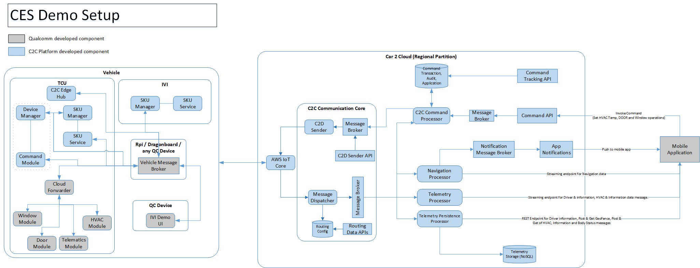
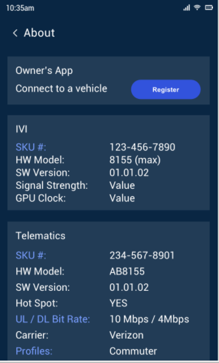
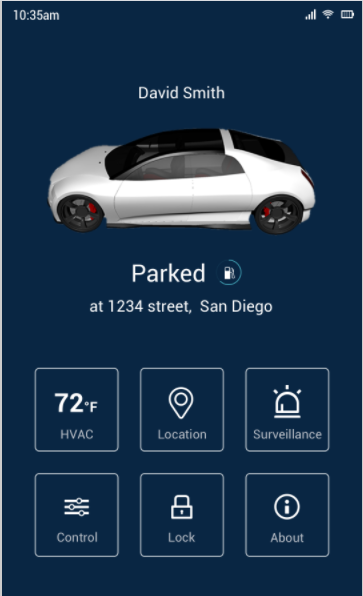
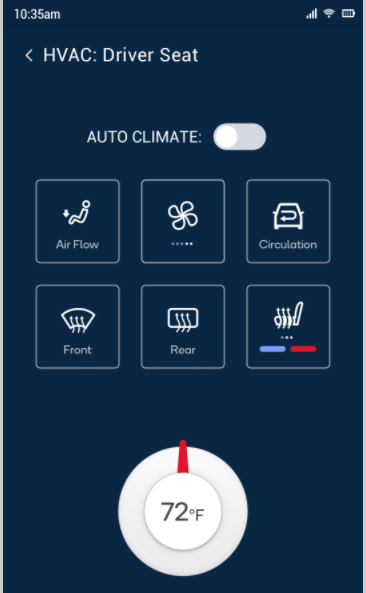
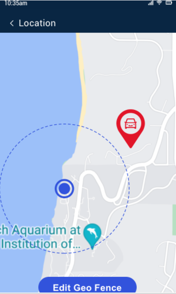
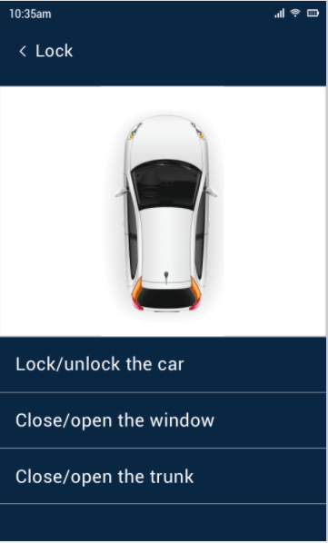
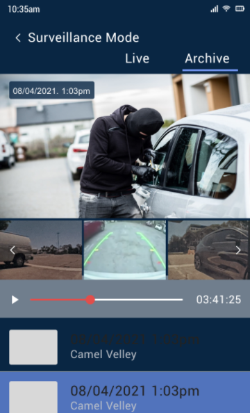

# CES 2022

## __Introduction__

The document describes the CES Demo goal and associated integration requirement. It will also entails about high level module integration point and contract definition. i.e., how the components work together to fulfill the system requirements.

## __High Level Setup__

Solution will have updates on Device & Cloud side. The ownership of the development is defined below:

1. Grey shaded modules are having QC ownership.
2. Blue shaded modules are having CTS ownership.

## __Environments__

### Cloud environment details

### Device environment details

## __Geo Fence - Web app requirements__

## __Mobile app - Demo Requirements__

Following are the screens as part of Mobile App and as of now most of the communication is between Mobile & Vehicle. No other interface considered for CES Demo.

|__Mobile App Requirements__||
:----|:---- 
 | __Mobile App Screen: About__   Flow:   Pre-requisite:  - VIN for the demonstration is pre-registered and in Active state on the cloud.  - User will launch the Owners App and Register VIN for the App-VIN mapping.  - Once registration is updated in mobile app an API call will fetch the present info for the screen.  - Normal  - API call to get the info (API/TCU) for all attribute as current state.  - Any further update will be dynamic and it is via web socket mechanism.
 | __Mobile App Screen: Home Page__   - Normal Flow:  - On page open the info api will provide the driver information.  - The api call will provide the current long, lat of the vehicle.  - Any continuous/dynamic data from cloud will be delivered via web socket.   - Reverse Geocoding of Location will be done at mobile app.  - (Assumption --> Location data is coming from device every 1 sec)  - Parked --> Ignored as of now for CES demo.  - HVAC --> It will show the target_temp, needs to be fetched via telemetry api.  - Rest of the icons are static in nature on this screen. 
 | __Mobile App Screen: HVAC__  - Normal Flow:  - All icons are static except HVAC Temp.  - Temp value coming from Cloud (Target Temperature)  - Temp is applicable --> 4 Zone (Target Temperature), as of now single zone for the CES demo.  - Auto Climate --> No change is required
 | __Mobile App Screen: Location__   - Normal Flow:  - Navigation data will provide the current location of the vin along with web socket feed.  - Geofence API to create/read/edit/delete (Lat, Long, Radius)  - Possibility assign Geofence to the vehicle  - We will have option to select the geofence applicable events for created Geofence  - Event applicability for the Geofence needs to be applied during creation i.e IN, OUT or Both are applicable for the Geofence.  - No multi-geofence requirement as of now for CES demo  - Once Geofence associated to the vehicle any point of time the breach will cause notification via push notification to the mobile app.
 | __Mobile App Screen: Lock__   - Normal Flow  - Lock/Unlock Car: This option is possible to do from Mobile App as well as Vehicle.  - Close/Open Window: This option is possible to do from Mobile App as well as Vehicle.  - Close/Open Trunk: This option is possible to do from Mobile App as well as Vehicle.  - The command api will be used from the Mobile app to perform the above operations
 | __Mobile App Screen: Surveillance Mode__  - Normal Flow  - No integration is required from cloud for CES Demo

### Vehicle Messages

#### Vehicle Events

The vehicle side data is majorly clubbed into following segments:

- Information : This will be initially sent by the Vehicle to the cloud. [Message Structure](../../messagestructure/informationtelemetrymessage/)
- Driver Information : This will provide the Driver information. [Message Structure](../../messagestructure/driverinformationtelemetry/) 
- Navigation : This will be sent based on the predefined configuration ~1 Sec. [Message Structure](../../messagestructure/navigationmessage/) 
- Telemetry : This is for HVAC data primarily for CES demo. [Message Structure](../../messagestructure/telemetrymessage/) 
- Body Status : This is covering Window/Door events. [Message Structure](../../messagestructure/statustelemetrymessage/) 

#### Vehicle Commands

Following are the consideration for CES demo: [Refer](../../messagestructure/commandmessage/) 

- The command will be strategized for CES demo as fire and forget way i.e no feedback from vehicle for command status.
-  Following command will be supported for CES Demo:
	- Under HVAC - target_temp 
	- Under BODY_STATUS 
		- Lock/Unlock Vehicle
		- Close/Open Window
		- Close/Open Trunk

#### API for Integration

Following are the API’s considered for the CES demo:

- Geofence : This is to manage Geofence in the platform and it is allowed to perform complete CRUD operations and provide vin/system\_id for the associations.
- Telemetry : Vehicle navigation, vehicle information, driver information, body parts status, telemetry device data been covered by this APIs.
- Body Status: The api will provide the body status of the vehicle. Currently Door & Windows are in scope.
- Notification : In App notification.

For details on API signature please refer: [Telemetry APIs](../../api/telemetryapi/) 

### Device Side Topic Strategy

#### Event Topics

Following are the topics for the messages being categorizes based on information we need on Mobile App.  
QC module need to publishes to these topics:

 * DM/RECV/INFROMATION - For information related message.
 * DM/RECV/DRIVER_INFO - For Driver information  
 * DM/RECV/NAVIGATION - For information related to GPS data.  
 * DM/RECV/TELEMATICS - For telemetry information, predominantly HVAC data.  
 * DM/RECV/BODY_STATUS - Door/Window Events  
 * DM/RECV/COMMAND/<command> - For Command response (Not applicable for CES Demo)  

#### Command Topics

QC module will subscribe to following topic for command consumption:  

 * DM/SEND/COMMAND/<command> - The command will be delivered to this topic.

Example:

 * DM/SEND/COMMAND/BODY_STATUS  - For Body related commands
 * DM/SEND/COMMAND/TELEMATICS   - For HVAC related commands

Note: We are looking towards topic & message optimization and might approach differs in future for command consumptions. We are willing to have the topic hierarchy to handle this in optimize way. Will discuss and plan in case time allows.

## Assumptions & Considerations

 * The devices for CES is being prepared by Anto and team.
 * Common MQTT broker needs to be used for the CES Demo.
 * Units for the messages payload are pre-defined and fixed in particular unit. Example: speed will be in meters/second.
 * Only single Geofence is applicable for CES demo per vehicle.
 * 2 to 3 Vehicle setup is planned for CES demo.
 * The info api call to the cloud with vin will provide the system\_id to the mobile app. 
	- Need to plan any further cloud communication based on system\_id
	- Mobile app needs to call info api in case system\_id is not available at mobile app.
 * Reverse geocoding will be managed at the mobile app side and no cloud api is required for this.
 * Frequency of the messages from device side will be captured by QC team for each message type
	- Navigation Frequency: 1 Sec ??
	- Information : 5 min??
	- Telemetry : 1 min ??
	- Body Status : on event basis
 * Command response from device side is not considered for CES demo, however it is considered as part of command & control framework and message structure.
 * The Geofence notification will be restricted to the state change.
 * Need to finalize the Demo environment, Can we take “QC Demo” environment??
 * Need to finalize the C2C version details??
 * Vehicle to User (via profile details) association will be taken care by the QC team using internal components. Cloud doesn’t have to keep the mapping information.

