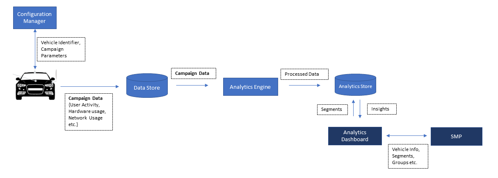

# Unified Analytics Dashboard

OEM end users of the vehicle can experience new features ,utilize the applications and control various vehicle functionalities through the infotaintment unit of the vehicle. Vehicle should stay connected with high quality network connectivity for the pupose of improving overall driving and ownership experience. 

Connected vehicles generate data streams from infotainment units, fuel systems, advanced driver assistance systems (ADAS) and other systems that monitor vehicle operations. Hidden in the data are valueable clues regarding the performance and health of vehicle. Analysis of data reveal the meaningful trends and patterns that can help provide a better user/driver experience, improve vehicle connectivity, quality and reliaility. The result is a stronger competitive position and new revenue opportunities. 

Unified Analytics Dashboard solution provided by C2C Platform provide the users with the below benefits :

* Provides patterns or trends within the information collected by the vehicle. Various performance metrics of the vehicle are captured 

* Analytics Dashboard helps the users/OEMs to gain insights into customer behavior to provide a more personalized experience and thus take decisions in which all areas they need to improve to have growth in the automotive industry . 

* It helps to improve areas like processor performance, connectivity performance, understand end users for offering trial services, understand driver/user behavior to improve the road safety, performance/mileage etc.

* It also entails applying data patterns towards effective decision-making. It involves sifting through massive data sets to discover, interpret, and share new insights and knowledge which helps to leverage the OEMS to next level. 

## How it Works

Data collections campaigns (Vehicle Identifer, Campaign Parameter) will be scheduled by Configuration Manager to collect the various data loggers from vehicle to backend. Some analytics algorithm and calculation by analytics engine will be applied on top of this campaign data and this processed data will be displayed to Analytics Dashboard through APIs. The segments and vehicle information created from the dashboard is made available in SMP for further updates.
Analytics provides many ways to access, organize, and visualize the data to suit the business needs. It also helps to analyze data quickly and encourage collaboration with an easy-to-use interface.

Unified Analytics Dashboard offers the below features- 

***Segment Creation*** - 
	Analytic Dashboard helps the user to create segments/Vechicle groups, inorder to supervise and organize vehicles for monitoring various performance
	metrices in a giffy.
	User will be able to apply filters based on different categories like user behavior, Connectivity, performance metrics and Car information, which helps them to analyze the vehicle data easily.
	The Segments created through analytics dashboard will be made available through SMP portal to perform further updates like Soft SKU, Package updates etc. 
	
***Vehicle Location*** -
	The OEMs will be able to view the geographical location of the vehicle on a map. This will enable OEM to understand the number of vehicles in a particular region. 
	
***User Behavior*** -
	The OEMs can leverage user behavior data to generate behavioral insights, to outperform their peers in sales growth and Gross Margin.
	Analytic Dashboard helps in this direction by projecting the driving statistics, best selling vehicle brands and models.

***Application Data utilization*** - 
	Monitoring of the Utilization of Apps consumed by infotainment units inside the vehicle helps teh OEM to offer new/trial services.

***Connectivity performance*** - 
	With the continued roll-out of 5G, coupled with access to 4G LTE services, the connected car will transform once again and become a software-defined,
	network-aware, ultra-connected car that will transmit data and “interact” with the road and every other vehicle around it.
	Using Unified Analytic Dashboard, OEM can assess the trend of Connectivity through graphical representations,
	based on which decisions can be made whether the connectivity needs an upgradation or not.
	
***Processor Performance*** - 
	The processors power in-vehicle infotainment (IVI) and advanced driver assistance systems (ADAS).
	There are many specialized processors like quad-core CPU, a powerful GPU, and dedicated audio, video, and image processors in the vehicle to handle more applications and functionalities. If the utilization of processor is high, it will effect the proper working of the application.
	Using Analytic Dashboard, OEM can assess the trend of processor/CPU/GPU performance through graphical representations,
	based on which decisions can be made whether a processor needs an upgradation or not.
	
***Data Monitoring*** - 
	Unified Analytics Dashboard offers OEM the insights about the variations in various performance metrics after any kind of update like SOft SKU, 
	Package update etc happened to vehicle which helps to make decisions in having the sales growth.
	
	

## References
