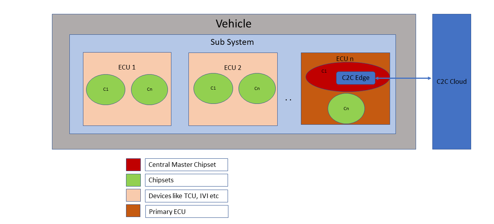
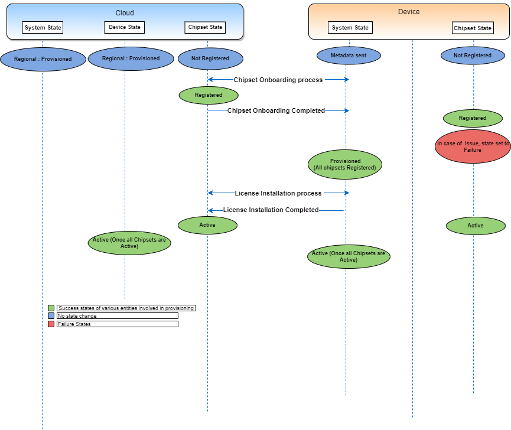
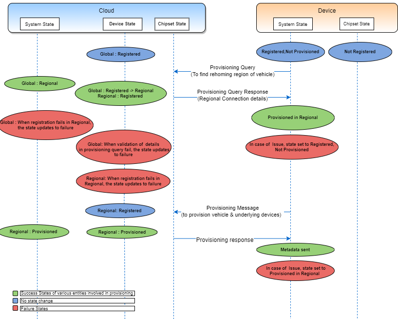

## Definition Hierarchy

1. Each vehicle has a virtual Subsystem layer which can either be Entertainment, Display or Navigation Systems, etc., which is unique to vehicle make and model. 
   (However currently multiple subsystems are not supported)
2. Each "Sub-system" has one or more ECU's. There are 3 types of ECU's - TCU(Telematics Control Unit), IVI(In-Vehicle Infotainment), ADAS(Advanced Driver Assistance System). 
Out of these, an ECU manufactured by Qualcomm acts as a primary ECU. If both TCU and IVI are from Qualcomm, TCU will act as primary.
3. Each ECU (Electronic Control Unit) have one or more chipsets.
The Qualcomm chipset inside the primary ECU, will act as the Central Master Chipset. C2C Edge will be a part of this Central Master Chipset and will estabilish the communcation with the C2C Cloud.
4. C2C Edge is part of C2C Platform and is software agent running on Central Master Chipset of the primary ECU. This inturn estabilish the communcation with the C2C Cloud. All the software agents/services running on other chipsets also communicates to the cloud through C2C Edge. 
5. C2C Cloud is part of C2C Platform and is software middleware hosted on public cloud / private cloud / on premise infrastructure.

## What is Provisioning

Provisioning is the one time process performed post the assembly/manufacturing of the vehicle/sub-system/ecu/chipset.

Provisioning involves authentication using X509 certificate with centralised cloud platform over Automotive OEM network connectivity, checking & validating correct configuration on hierarchy of entity(vehicle/sub-system/ecu and chipset) and enabling state of each entity from top to bottom hierarchy to ACTIVE for end user or user application readiness.

Upon successful completion of provisioning process entity will be ACTIVE / ENABLED state so that end user can view/use/experience features or characteristics of the same.

## When Provisioning is triggered

Provisioning is initiated post registration process.
It is triggered by C2C Edge once gateway hardware boots up for the first time.

## How Provisioning works

End user avails C2C Platform services only after successful provisioning hierarchy of vehicle/sub-system/ecu/chipset. 

Vehicle manufacturers can easily expand services to new segments and regions via the C2C platform. C2C platform deployment model is flexible, with a central node (Global) and regional nodes based upon varying market requirements and local regulations. Since the solution is global and manages all local markets you can both easily deploy global services but also manage local content and services and adhere to local regulations and privacy laws

Provisioning happens in a two step process -  

* For the first time boot up of the vehicle, the vehicle establish the communication (through Auto OEM provided network) with the Global node and it provides regional details where the vehicle need to be rehomed.

* The vehicle is registered in regional instance and all the hardware units of the vehicle are provisioned and activated to regional node in order to exchange different types of data (for eg: infotainment, driver assistance etc) .
The vehicle becomes active once the vehicles and all its hardware units are identified, authenticated and successfully attested in the regional node. 

## State Transitions during Provisioning

As part of provisioning, vehicle and device information is identified in its rehoming region. This is followed by Onboarding of the underlying chipsets and the licenses for these chipsets are installed for the users to experience the features in the vehicle.

In this process, all these entities undergo various state changes between C2C Edge and C2C cloud components which are synchronized to perform further steps.

#### Provisioning States

#### Chipset Onboarding and License Installation States

Initially a platform license file is placed inside a chipset which holds a set of default features with which manufacturer/OEMs can test all the features of chipset and confirm whether it is working fine. At time of vehicle onboarding, default features are upgraded based on the vehicle type. For eg: Features of Base model vehicle type is upgraded to premium category based on vehicle configuration set by OEM. The consumers will experience the features related to premium category only after vehicle receives the corresponding initial license from C2C platform. 

!!! info "Reference"
	1. Device Provisioning Sequence Diagram - <https://cognizantonline.sharepoint.com/:b:/r/sites/QCC2CLeadsCognizant/Shared%20Documents/Sequence%20Diagram/DeviceProvisioning.pdf?csf=1&web=1&e=hKXibg>{target=_blank}

