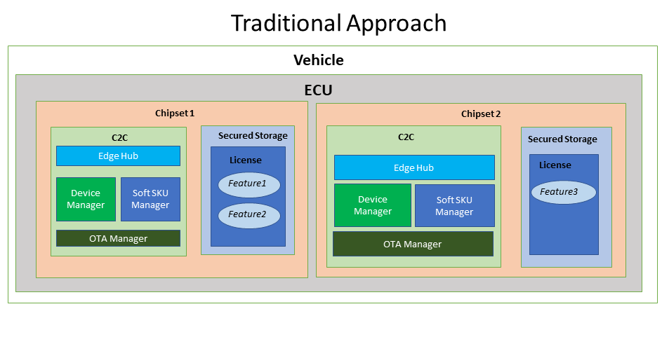
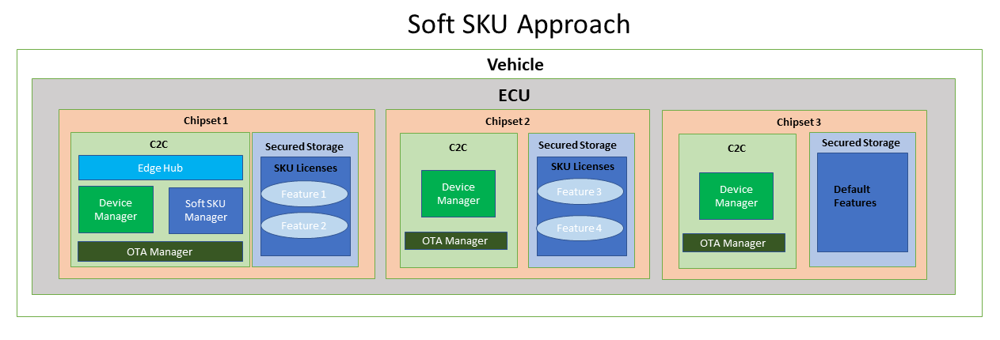

### Soft SKU

SKU stands for Stock Keeping Unit.Every Chipset, has a hardware, software feature associated with it and SKU refers to this collection of features. These Chipsets are mounted on the ECU’s which in turn are installed in the Vehicles, which can be controlled and managed remotely via commands or operations through SMP.

Soft SKU  enables the OEMs in below ways

* Dynamically configure/upgrade the features inside the vehicle securely at any time based on demand of consumers. 
* This offers automakers to keep the cockpit and telematics systems up-to-date via field-upgradeable chips, inorder to keep pace with the increasing performance requirements due to new functionality additions, changing technology trends and vehicle maintenance. 
* The end-consumer can thus continuously access the latest updates and features throughout the life-cycle of the vehicle. Soft SKU is implemented via License Mechanism. Qualcomm C2C platform generate the chipset specific license for these features and make it available in vehicle for the end user experience. 
* Prior to device registration, millions of chipsets/hardwares are manufactured to configure different features. Soft SKU offers the capability to manufacture less hardware without spending excess funds and can activate new features.For eg: OEMs can improve their vehicle connectivity from 4G to 5G without any update to the hardware. Single chipset/hardware can thus accomodate multiple features by a single license generation. 
* This protected functionality allows to adapt vehicles according to regional requirements and to implement functions according to a product segment.

<!--Multiple licenses need to be generated to experience these features of different hardware units-->

#### Approach

 

In tradional approach the chipset inside device is designed for a custom requirement. For E.g. If a chip is designed for 2GHz speed and only one front camera, and suppose an  additional feature like a rear camera needs to be accomodated, a new vehicle has to be rolled out with those features. 

As part of Soft SKU approach, there will be 'N' number of identical chipsets at time of manufacturing which can support even features of premium vehicle. Based on consumer needs the features are dynamically configured/enabled/upgraded on the chipsets without any change in underlying hardware. For eg: if both front and rear camera need to be enabled, or to upgrade the connectivity from 3G to 4G, these are done without roll out of a new vehicle or additional chipset. Manufacturing cost of hardware and related license costs are less in the soft SKU approach.

#### Soft SKU Benefits 

  * On demand activation of feature with highly configurable hardware
  * Reduction in hardware & license costs  
  * Regional customization and feature upgrades tailored for specific product segments. 
  * Customizable options for consumers, thereby offering rich and immersive in-vehicle experiences.

