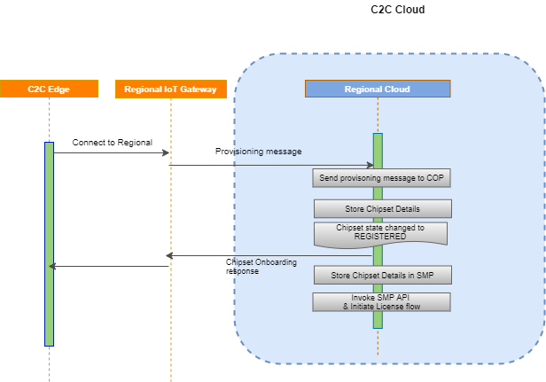

# Chipset Onboarding

## Workflow

### Chipset Onboarding & Response

To enable the Soft SKU on the chipset, the chipsets linked with device need to be identified first. This is done through the attestation process in which the device will send back the chipsets and identifiers associated with it to Qualcomm System. QWES validate the chipset details. For validating the chipset identity , the chipsets should be on boarded  and stored in the backend. 

The workflow of chipset onboarding is mentioned in below steps :

1. Invoke Chipset Onboarding Processor (COP): As part of device provisioning, chipset onboarding message send to C2C regional platform. Provisioning processor push the provisioning message to chipset onboarding queue which will be listened by chipset onboarding processor

2. Update Regional Data Store : COP will capture the chipset details in regional data store and chipset state will be updated as "REGISTERED" 

3. Send back response to device : After the chipsets are registered successfully, the onboarding response is send back to device

4. Update SMP Database : COP will update chipset & vehicle details in the SMP database

5. Invoke SMP API : COP invoke SMP API and the license installation will be initiated 

Note : The worflow of attestation process will be updated later once requirement is completed

{!messagestructure//chipsetonboardingnonce.md!}

{!messagestructure//chipsetonboardingnonceresponse.md!}

{!messagestructure//chipsetonboardingresponse.md!}

