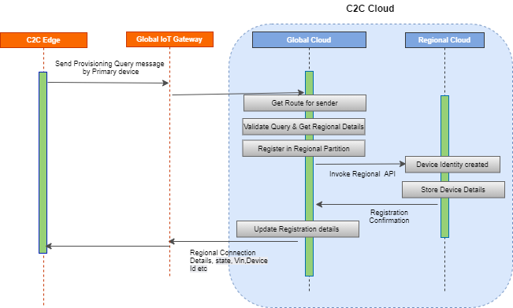
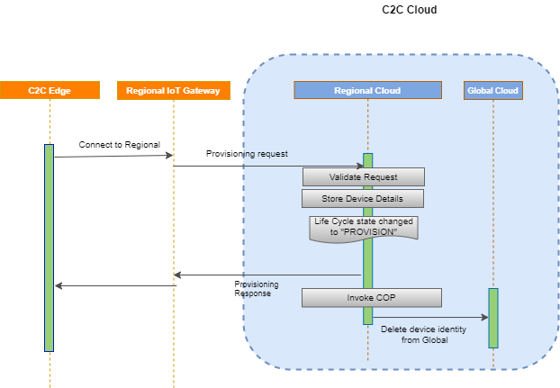

# Vehicle Provisioning

## Workflow

### Provisioning Query & Response

 
 
 The work flow of provisioning query & response is explained in below steps :
 
 1. Provisioning Query message routing & validation : Provisioning Query message flow will be initiated by the primary device of the system/vehicle. As part of provisioning when the device boot up for first time the device connect to global partition using credentials received as part of registration. Once the device is connected with Global cloud, the end points for the sender will be retrieved and message will be pushed to queue . Provisioning query will be validated amd match with existing registered data. 
 2. Updating Global device store : Some of additional attributes like VIN etc will be udpated to global device data store                              
 3. Finding Rehoming regional details : The vehicle need to be registered in regional instance and all the hardware units of the vehicle need to be provisioned and activated to regional node in order to exchange different types of data. Global partition identifies home/region for vehicle & its devices.
 4. Rehoming vehicle : Vehicle is registered in the Regional instance by creating device identity and the device details are stored in regional data store
 5. Update Status in Global partition :  On successful regional registration, the status will be updated in global partition
 6. Life Cycle state update : On successful regional registration, the life cycle state will be updated as "REGIONAL" in global partition
 7. Send Response to Device : Global partition send the regional connection details, status , Vin, Device ID etc to C2C edge. Here after device start communicating with regional partition 

{!messagestructure//provisioningquery.md!}

{!messagestructure//provisioningqueryresponse.md!}

### Provisioning & Response

 
 
 Provisioning process will be performed by all devices, in which the primary one will be provisioned first followed by others. Provisioning work flow is explained in below steps :
 
 1. Connect to Regional cloud : After successful rehoming of vehicle in regional partition, the vehicle starts connecting to regional cloud and start sending the provisioning message. This is the first time device will connect to regional instance
 2. Validate Incoming Request : Provisioning processor validate the incoming provisioning request 
 3. Update Regional Data Store : Device details will be updated in regional instance and associate the device with VIN, SIM details etc
 4. Life Cycle State : On successful regional device store updation, the life cycle state will be updated as "PROVISIONED" 
 5. Send response to Device : Regional partition send response message with provisioned status to device
 6. Invoke Chipset Onboarding Processor : The provisioning message from device will be placed on queue which will be read by Chipset Onboarding processsor.
 7. Delete the device identity : Global partition API will be invoked to delete the device identity from Global IoT Core

{!messagestructure//deviceprovisioning.md!}

{!messagestructure//deviceprovisioningresponse.md!}

